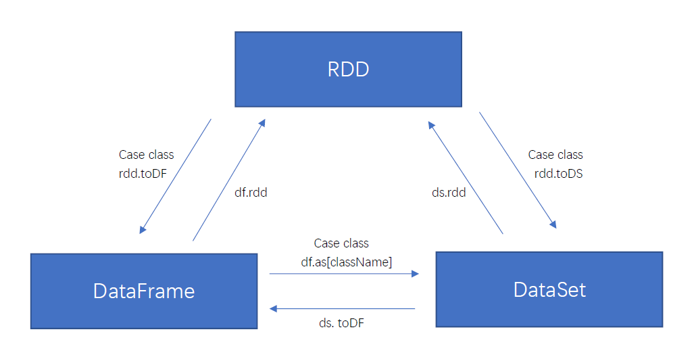

# 初始化 Spark

Spark 程序必须做的第一件事情是创建一个 `SparkContext` 对象，它会告诉 Spark 如何访问集群。要创建一个 `SparkContext`，首先需要构建一个包含应用程序的信息的 `SparkConf` 对象。

每一个 JVM 可能只能激活一个 SparkContext 对象。在创新一个新的对象之前，必须调用 `stop()` 方法停止活跃的 SparkContext。

```scala
val conf = new SparkConf().setAppName(appName).setMaster(master)
val sc   = new SparkContext(conf)
```

这个 `appName` 参数是一个在集群 UI 上展示应用程序的名称。 `master` 是一个 Spark, Mesos 或 YARN 的 cluster URL，或者指定为在 local mode（本地模式）中运行的 “local” 字符串。在实际工作中，当在集群上运行时，您不希望在程序中将 master 给硬编码，而是使用 `spark-submit` 启动应用并且接收它。然而，对于本地测试和单元测试，您可以通过 “local” 来运行 Spark 进程。


# 弹性分布式数据集 (RDDs)

​	Spark 主要以一个 *弹性分布式数据集*（RDD）的概念为中心，它是一个容错且可以执行并行操作的元素的集合。每个 RDD 有五个主要属性：

  - A list of partitions
  - A function for computing each split
  - A list of dependencies on other RDDs
  - Optionally, a Partitioner for key-value RDDs (e.g. to say that the RDD is hash-partitioned)
  - Optionally, a list of preferred locations to compute each split on (e.g. block locations for an HDFS file)


## RDD 的创建

有两种方法可以创建 RDD : 

​	① 在 driver program（驱动程序）中 *parallelizing* 一个已存在的集合

​	② 在外部存储系统中引用一个数据集，例如，一个共享文件系统，HDFS，HBase，或者提供 Hadoop InputFormat 的任何数据源

```scala
val data = Array(1, 2, 3, 4, 5)
val distData = sc.parallelize(data)
```

```
scala> val distFile = sc.textFile("data.txt")
distFile: org.apache.spark.rdd.RDD[String] = data.txt MapPartitionsRDD[10] at textFile at <console>:26
```


## RDD 操作

​	RDD 支持两种类型的操作：转换（*transformations*，从现有数据集创建新数据集）和操作（*actions*，在数据集上运行计算后将值返回到驱动程序）。例如，map 是一个转换，它通过一个函数传递每个数据集元素，并返回一个表示结果的新 RDD。另一方面，reduce 是一个使用某个函数聚合 RDD 的所有元素的操作，并将最终结果返回给驱动程序（尽管还有一个返回分布式数据集的并行 reduceByKey）。

​	Spark 中所有的 transformations 都是 *lazy（懒加载的）*, 因此它不会立刻计算出结果。相反, 他们只记得应用于一些基本数据集的转换。只有当需要返回结果给驱动程序时，transformations 才开始计算。例如, 我们可以了解到，`map` 所创建的数据集将被用在 `reduce` 中，并且只有 `reduce` 的计算结果返回给驱动程序，而不是映射一个更大的数据集。

​	默认情况下，每次在 RDD 运行一个 action 时， 每个 transformed RDD 都会被重新计算。但是，也可用 `persist` (或 `cache`) 方法将 RDD persist（持久化）到内存中；在这种情况下，Spark 为了下次查询时可以更快地访问，会把数据保存在集群上。此外，还支持持续持久化 RDDs 到磁盘，或复制到多个结点。


### 转换（transformations）

#### value 类型

##### map[U](f: (T) ⇒ U): RDD[U]

​	通过将函数应用于此 RDD 的所有元素来返回新的 RDD。

##### mapPartitions[U](f: (Iterator[T]) ⇒ Iterator[U], preservesPartitioning: Boolean = false): RDD[U]

​	通过将函数应用于此 RDD 的每个分区来返回新的 RDD。*preservesPartitioning* 表示输入函数是否保留分区器，除非这是一对 RDD 并且输入函数不修改键，否则该分区器应为 false。	

##### mapPartitionsWithIndex[U](f: (Int, Iterator[T]) ⇒ Iterator[U], preservesPartitioning: Boolean = false): RDD[U]

​	通过将函数应用于此 RDD 的每个分区来返回新的 RDD，同时跟踪原始分区的索引（func 带有一个整数参数表示分片的索引值）。

```scala
scala> val rdd = sc.parallelize(Array(1, 2, 3, 4))
rdd: org.apache.spark.rdd.RDD[Int] = ParallelCollectionRDD[4] at parallelize at <console>:24

scala> val indexRdd = rdd.mapPartitionsWithIndex((index, items) => (items.map((index, _))))
indexRdd: org.apache.spark.rdd.RDD[(Int, Int)] = MapPartitionsRDD[5] at mapPartitionsWithIndex at <console>:26
```

##### flatMap[U](f: (T) ⇒ TraversableOnce[U]): RDD[U]

​	通过首先将函数应用于此 RDD 的所有元素，然后展平结果，返回新的RDD。每一个输入元素可以被映射为0或多个输出元素（所以 func 应该返回一个序列，而不是单一元素）。

##### glom(): RDD[Array[T]]

​	将每一个分区形成一个数组，形成新的 RDD。

```scala
scala> val rdd = sc.parallelize(1 to 16, 4)
rdd: org.apache.spark.rdd.RDD[Int] = ParallelCollectionRDD[65] at parallelize at <console>:24

scala> rdd.glom().collect()
res25: Array[Array[Int]] = Array(Array(1, 2, 3, 4), Array(5, 6, 7, 8), Array(9, 10, 11, 12), Array(13, 14, 15, 16))
```

##### groupBy[K](f: (T) ⇒ K): RDD[(K, Iterable[T])]

​	按照传入函数的返回值进行分组，将相同的 key 对应的值放入同一个迭代器。

```scala
scala> val rdd = sc.parallelize(1 to 4)
rdd: org.apache.spark.rdd.RDD[Int] = ParallelCollectionRDD[65] at parallelize at <console>:24

scala> val group = rdd.groupBy(_ % 2)
group: org.apache.spark.rdd.RDD[(Int, Iterable[Int])] = ShuffledRDD[2] at groupBy at <console>:26

scala> group.collect
res0: Array[(Int, Iterable[Int])] = Array((0,CompactBuffer(2, 4)), (1,CompactBuffer(1, 3)))
```

##### filter(f: (T) ⇒ Boolean): RDD[T]

​	返回一个新的 RDD，该 RDD 由经过 func 函数计算后返回值为 true 的输入元素组成。

##### sample(withReplacement: Boolean, fraction: Double, seed: Long = Utils.random.nextLong): RDD[T]

​	返回此RDD的采样子集。`withReplacement`：是否可以多次对同一个元素进行采样 —— 采样时是否替换（是否有放回抽样，true 为有放回抽样、替换，false 为无放回抽样、无替换）；`fraction`：无替换时（false）表示选择每个元素的概率，分数必须是[0,1]，替换时（true）表示预期每个元素的选择次数，分数必须大于或等于0；`seed`：随机数生成器的种子。

​	Note : This is NOT guaranteed to provide exactly the fraction of the count of the given RDD.

##### distinct([numPartitions: Int]): RDD[T]

​	对源 RDD 进行去重后返回一个新的 RDD。默认情况下，只有 8 个并行任务来操作，但是可以传入一个可选的 numPartitions 参数改变它。

##### coalesce(numPartitions: Int, shuffle: Boolean = false, partitionCoalescer: Option[PartitionCoalescer] = Option.empty): RDD[T]

​	返回一个缩减为 numPartitions 分区的新 RDD，用于大数据集过滤，提高小数据集的执行效率。

```scala
scala> val rdd = sc.parallelize(1 to 16, 4)
rdd: org.apache.spark.rdd.RDD[Int] = ParallelCollectionRDD[54] at parallelize at <console>:24

scala> rdd.partitions.size
res20: Int = 4

scala> val coalesceRDD = rdd.coalesce(3)
coalesceRDD: org.apache.spark.rdd.RDD[Int] = CoalescedRDD[55] at coalesce at <console>:26

scala> coalesceRDD.partitions.size
res21: Int = 3
```

##### repartition(numPartitions: Int): RDD[T]

​	返回一个具有正确 numPartitions 分区的新 RDD，可以增加或减少此 RDD 中的并行度。 在内部，它使用shuffle 重新分配数据，因此如果要减少此 RDD 中的分区数，请考虑使用 coalesce，这可以避免执行 shuffle。

```scala
scala> val rdd = sc.parallelize(1 to 16, 4)
rdd: org.apache.spark.rdd.RDD[Int] = ParallelCollectionRDD[56] at parallelize at <console>:24

scala> rdd.partitions.size
res22: Int = 4

scala> val rerdd = rdd.repartition(2)
rerdd: org.apache.spark.rdd.RDD[Int] = MapPartitionsRDD[60] at repartition at <console>:26

scala> rerdd.partitions.size
res23: Int = 2
```

​	Note : repartition 实际上是调用的 coalesce，进行 shuffle。

```scala
def repartition(numPartitions: Int)(implicit ord: Ordering[T] = null): RDD[T] = withScope {
  coalesce(numPartitions, shuffle = true)
}
```

##### sortBy[K](f: (T) ⇒ K, ascending: Boolean = true, numPartitions: Int = this.partitions.length): RDD[T]

​	返回按给定函数排序的 RDD，默认正序。

```scala
scala> val rdd = sc.parallelize(List(2, 1, 3, 4))
rdd: org.apache.spark.rdd.RDD[Int] = ParallelCollectionRDD[21] at parallelize at <console>:24

scala> rdd.sortBy(x => x).collect()
res11: Array[Int] = Array(1, 2, 3, 4)

scala> rdd.sortBy(x => x % 3).collect()
res12: Array[Int] = Array(3, 4, 1, 2)
```

##### pipe(command: String[, env: Map[String, String]]): RDD[String]

​	针对每个分区，都执行一个 shell 脚本，返回输出的 RDD。`command`：脚本路径；`env`：要设置的环境变量。

​	*注意* ：脚本需要放在 Worker 节点可以访问到的位置。


#### 两个 RDD 之间

##### union(other: RDD[T]): RDD[T]

​	返回此 RDD 与另一个 RDD 的并集，任何相同的元素都会出现多次（使用 .distinct() 来消除它们）。

##### subtract(other: RDD[T]): RDD[T]

​	返回此 RDD 与另一个 RDD 的差集。

##### intersection(other: RDD[T]): RDD[T]

​	返回此 RDD 与另一个 RDD 的交集，输出不会包含任何重复元素。

​	*注意* ：此方法在内部会执行 shuffle。

##### cartesian[U](other: RDD[U]): RDD[(T, U)]

​	返回此 RDD 与另一个 RDD 的笛卡尔集，尽量避免使用。

##### zip[U](other: RDD[U]): RDD[(T, U)]

​	将两个 value 类型的 RDD 组合成 Key/Value 形式的 RDD,这里默认两个 RDD 的 partition 数量以及元素数量都相同，否则会抛出异常。


#### Key-Value 类型

##### partitionBy(partitioner: Partitioner): RDD[(K, V)]

​	对 pairRDD 进行分区操作，如果原有的 partionRDD 和现有的 partionRDD 一致的话就不进行分区， 否则会产生 shuffle 过程，返回新的 RDD。

##### reduceByKey(func: (V, V) ⇒ V[, numPartitions: Int]): RDD[(K, V)]

​	使用关联的（例如 (a×b)×c = a×(b×c) ）和可交换的（例如 a×b = b×a） reduce 函数合并每个键的值。在将结果发送到 reducer 之前，会在每个 Mapper 上本地执行合并，类似于 MapReduce 中的 combiner。输出将使用现有的 partitioner/parallelism level（并行级别）进行散列分区，也可指定并行级别。

```scala
scala> val rdd = sc.parallelize(List(("female", 1), ("male", 5), ("female", 5), ("male", 2)))
rdd: org.apache.spark.rdd.RDD[(String, Int)] = ParallelCollectionRDD[46] at parallelize at <console>:24

scala> val reduce = rdd.reduceByKey(_ + _)
reduce: org.apache.spark.rdd.RDD[(String, Int)] = ShuffledRDD[47] at reduceByKey at <console>:26

scala> reduce.collect()
res29: Array[(String, Int)] = Array((female,6), (male,7))
```

##### groupByKey(): RDD[(K, Iterable[V])]

​	将 RDD 中每个键的值分组为单个序列。使用现有的 partitioner/parallelism level（并行级别）对生成的 RDD 进行散列分区，不保证每个组内元素的排序，并且每次执行的结果 RDD 甚至有可能不同。

​	*注意* ：这种操作可能非常昂贵，如果要对每个键执行聚合（例如求和或平均值），则使用 PairRDDFunctions.aggregateByKey 或 PairRDDFunctions.reduceByKey 将提供更好的性能。

##### aggregateByKey[U](zeroValue: U[, partitioner: Partitioner])(seqOp: (U, V) ⇒ U, combOp: (U, U) ⇒ U): RDD[(K, U)]

​	使用给定的组合函数（combOp）和中性的初始值（zero value）聚合每个键的值。 `seqOp` 用于合并分区中的值，`combOp` 用于合并分区之间的值。

​	<font color=red> *注意* ：zero value 只会在 seqOp 执行，即每个分区会参与计算一次，分区合并时不会参与计算，与 Action `aggregate` 区分开。</font>

执行步骤：
​	① 按 key 对 pairRDD 分区（组）
​	② 在每一个分区，将 RDD 的每个 value 和初始值作为 seqOp 函数的参数进行计算，返回一个新的 pairRDD
​	③ 将新 pairRDD 不同分区的 value 传递给 combOp 进行计算，实现分区间的合并，再返回一个新的 pairRDD，即最终结果

```scala
scala> val rdd = sc.parallelize(List(("a", 3), ("a", 2), ("c", 4), ("b", 3), ("c", 6), ("c", 8)), 2)
rdd: org.apache.spark.rdd.RDD[(String, Int)] = ParallelCollectionRDD[0] at parallelize at <console>:24

scala> val agg = rdd.aggregateByKey(0)(math.max(_, _), _ + _)
agg: org.apache.spark.rdd.RDD[(String, Int)] = ShuffledRDD[1] at aggregateByKey at <console>:26

scala> agg.collect()
res0: Array[(String, Int)] = Array((b,3), (a,3), (c,12))
```

##### foldByKey(zeroValue: V)(func: (V, V) ⇒ V): RDD[(K, V)]

​	使用关联函数（例如 (a×b)×c = a×(b×c) ） func 和初始值 zero value 合并每个键的值，`aggregateByKey` 的简化操作，seqOp 和 combOp 相同。

##### combineByKey[C](createCombiner: (V) ⇒ C, mergeValue: (C, V) ⇒ C, mergeCombiners: (C, C) ⇒ C): RDD[(K, C)]

​	使用一组自定义聚合函数组合每个键的元素，将 RDD [(K，V)] 转换为 RDD [(K，C)] 类型。

​	combineByKeyWithClassTag[C](createCombiner: (V) ⇒ C, mergeValue: (C, V) ⇒ C, mergeCombiners: (C, C) ⇒ C, partitioner: Partitioner, mapSideCombine: Boolean = true, serializer: Serializer = null)(implicit ct: ClassTag[C]): RDD[(K, C)] 的简化版本，使用现有的 partitioner/parallelism level（并行级别）对生成的 RDD 进行散列分区。
​	It does not provide combiner classtag information to the shuffle.

参数：
​	`createCombiner` : combineByKey() 会遍历分区中的所有元素，因此每个元素的键要么还没有遇到过，要么就和之前的某个元素的键相同。如果这是一个新的元素，combineByKey() 会使用 createCombiner() 来创建那个键对应的累加器的初始值
​	`mergeValue` : 如果这是一个在处理当前分区之前已经遇到的键，它会使用 mergeValue() 将该键的累加器对应的当前值与这个新的值进行合并
​	`mergeCombiners`  : 由于每个分区都是独立处理的， 因此对于同一个键可以有多个累加器。如果有两个或者更多的分区都有对应同一个键的累加器，就需要使用用户提供的 mergeCombiners() 将各个分区的结果进行合并

```scala
scala >val input = sc.parallelize(Array(("a", 88), ("b", 95), ("a", 91), ("b", 93), ("a", 95), ("b", 98)), 2)
input: org.apache.spark.rdd.RDD[(String, Int)] = ParallelCollectionRDD[52] at parallelize at <console>:26

scala> val combine = input.combineByKey((_,1),(acc:(Int,Int),v) => (acc._1 + v,cc._2 + 1),(acc1:(Int,Int), cc2:(Int,Int)) => (acc1._1 + acc2._1,cc1._2 + acc2._2))
combine: org.apache.spark.rdd.RDD[(String, (Int, Int))] = ShuffledRDD[5] at combineByKey at <console>:28

scala> combine.collect()
res5: Array[(String, (Int, Int))] = Array((b,(286,3)), (a,(274,3)))
```

##### sortByKey(ascending: Boolean = true, numPartitions: Int = self.partitions.length): RDD[(K, V)]

​	在一个 (K, V) 的 RDD 上调用，K 必须实现 Ordered 接口，返回一个按照 key 进行排序的 (K, V) 的 RDD（默认升序）。调用 `collect` 或 `save` 将返回或输出有序的记录列表（如果是 save，它们将按键的顺序写入文件系统中的多个 part-X 文件）。

```scala
scala> val rdd = sc.parallelize(Array((3, "aa"), (6, "cc"), (2, "bb"), (1, "dd")))
rdd: org.apache.spark.rdd.RDD[(Int, String)] = ParallelCollectionRDD[12] at parallelize at <console>:24

scala> rdd.sortByKey(true).collect()
res4: Array[(Int, String)] = Array((1,dd), (2,bb), (3,aa), (6,cc))

scala> rdd.sortByKey(false).collect()
res5: Array[(Int, String)] = Array((6,cc), (3,aa), (2,bb), (1,dd))
```

##### mapValues[U](f: (V) ⇒ U): RDD[(K, U)]

​	Pass each value in the key-value pair RDD through a map function without changing the keys; this also retains the original RDD's partitioning.

```scala
scala> val rdd = sc.parallelize(Array((1, "a"), (1, "d"), (2, "b"), (3, "c")))
rdd: org.apache.spark.rdd.RDD[(Int, String)] = ParallelCollectionRDD[0] at parallelize at <console>:24

scala> rdd.mapValues("value : " + _).collect()
res1: Array[(Int, String)] = Array((1,value : a), (1,value : d), (2,value : b), (3,value : c))
```

##### join[W](other: RDD[(K, W)]): RDD[(K, (V, W))]

​	在类型为 (K,V) 和 (K,W) 的 RDD 上调用，返回一个相同 key 对应的所有元素对在一起的 (K,(V,W)) RDD。在整个群集中执行散列连接。

​	类似的还有 leftOuterJoin[W](other: RDD[(K, W)]): RDD[(K, (V, Option[W]))]，rightOuterJoin[W](other: RDD[(K, W)]): RDD[(K, (Option[V], W))]，fullOuterJoin[W](other: RDD[(K, W)]): RDD[(K, (Option[V], Option[W]))]。

```scala
scala> val rdd = sc.parallelize(Array((1, "a"), (2, "b"), (3, "c")))
rdd: org.apache.spark.rdd.RDD[(Int, String)] = ParallelCollectionRDD[3] at parallelize at <console>:24

scala> val rdd1 = sc.parallelize(Array((1, 4), (2, 5), (3, 6)))
rdd1: org.apache.spark.rdd.RDD[(Int, Int)] = ParallelCollectionRDD[4] at parallelize at <console>:24

scala> rdd.join(rdd1).collect()
res2: Array[(Int, (String, Int))] = Array((2,(b,5)), (1,(a,4)), (3,(c,6)))
```

##### cogroup[W](other: RDD[(K, W)]): RDD[(K, (Iterable[V], Iterable[W]))]

​	对于两个 pairRDD 的每一个 key，返回一个 RDD，其中包含一个元组，元组的两个值分别是两个 pairRDD key 对应的 value 列表。

​	与此对应的还有 cogroup[W1, W2](other1: RDD[(K, W1)], other2: RDD[(K, W2)]): RDD[(K, (Iterable[V], Iterable[W1], Iterable[W2]))]，cogroup[W1, W2, W3](other1: RDD[(K, W1)], other2: RDD[(K, W2)], other3: RDD[(K, W3)], partitioner: Partitioner): RDD[(K, (Iterable[V], Iterable[W1], Iterable[W2], Iterable[W3]))]。

```scala
scala> val rdd = sc.parallelize(Array((1, "a"), (2, "b"), (3, "c")))
rdd: org.apache.spark.rdd.RDD[(Int, String)] = ParallelCollectionRDD[8] at parallelize at <console>:24

scala> val rdd1 = sc.parallelize(Array((1, 4), (2, 5), (3, 6)))
rdd1: org.apache.spark.rdd.RDD[(Int, Int)] = ParallelCollectionRDD[9] at parallelize at <console>:24

scala> rdd.cogroup(rdd1).collect()
res3: Array[(Int, (Iterable[String], Iterable[Int]))] = Array((2,(CompactBuffer(b),CompactBuffer(5))), (1,(CompactBuffer(a),CompactBuffer(4))), (3,(CompactBuffer(c),CompactBuffer(6))))
```


### 动作（actions）

##### reduce(f: (T, T) ⇒ T): T

​	使用指定的可交换的（例如 a×b = b×a）和关联的（例如 (a×b)×c = a×(b×c) ）二元运算符减少 RDD 的元素。先聚合分区内数据，再聚合分区间数据。

##### collect(): Array[T]

​	返回包含此 RDD 中所有元素的数组。

​	*注意* ：只有在结果数组较小时才应使用此方法，因为所有数据都会加载到 driver 的内存中。

##### count(): Long

​	返回 RDD 中的元素数。

##### first(): T

​	返回 RDD 中的第一个元素。

##### take(num: Int): Array[T]

​	获取 RDD 的前 num 个元素。它的工作原理是首先扫描一个分区，然后使用该分区的结果来估算满足 num 个数所需的其他分区数。

​	*注意* ：由于内部实现的复杂性，如果调用 RDD 为 Nothing 或 Null，此方法将引发异常；只有在结果数组较小时才应使用此方法，因为所有数据都会加载到 driver 的内存中。

##### takeOrdered(num: Int)(implicit ord: Ordering[T]): Array[T]

​	返回 RDD 中的第 k 个（最小）元素，由指定的隐式 Ordering [T] 定义并维护排序。
​	与 `top(num: Int)(implicit ord: Ordering[T]): Array[T]` 相反。

##### aggregate[U](zeroValue: U)(seqOp: (U, T) ⇒ U, combOp: (U, U) ⇒ U): U

​	使用给定的组合函数（combOp）和中性的初始值（zero value），聚合每个分区的元素，然后聚合所有分区的结果。

​	执行步骤：aggregate 函数将每个分区里面的元素通过 seqOp 和初始值进行聚合，然后用 combine 函数将每个分区的结果和初始值（zeroValue）进行 combine 操作。这个函数最终返回的类型不需要和 RDD 中元素类型一致。

​	<font color=red>*注意* ：zero value 会在 seqOp 和 combOp 执行，即会在分区内、分区合并时都参与计算，要与 Transformations `aggregateByKey` 区分开。</font>

##### fold(zeroValue: T)(op: (T, T) ⇒ T): T

​	使用关联函数（例如 (a×b)×c = a×(b×c) ） op 和中性的初始值 zero value 聚合每个分区的元素，然后聚合所有分区的结果。`aggregate` 的简化操作，seqOp 和 combOp 一样。

##### saveAsTextFile(path: String): Unit

​	将数据集中的元素以 Hadoop sequencefile 的格式保存到指定的目录下，可以是 HDFS 或者其他 Hadoop 支持的文件系统。

##### saveAsObjectFile(path: String): Unit

​	将 RDD 保存为序列化对象的 SequenceFile。

##### countByKey(): Map[K, Long]

​	计算每个键的元素数量，将结果收集到本地 Map。

​	*注意* ：只有在结果映射 Map 很小的情况下才应该使用此方法，因为整个 Map 都会加载到 dirver 的内存中。如果要处理非常大的结果，考虑使用 `rdd.mapValues(_ => 1L).reduceByKey(_ + _)`。

##### foreach(f: (T) ⇒ Unit): Unit

​	将函数 f 应用于 RDD 的每一个元素。

​	与之相对应的还有 `foreachPartition(f: (Iterator[T]) ⇒ Unit): Unit`，将函数 f 应用于 RDD 的每个分区。

*区别*：
​	`foreach` 是直接在每个 partition 中直接对 iterator 执行 foreach 操作，而传入的 function 只是在 foreach 内部使用，即 `iterator.foreach(foreachFunction)`；
​	`foreachPartition` 是在每个 partition 中把 iterator 传给 function，让 function 自己对 iterator 进行处理（可以避免内存溢出），即 `foreachPartitionFunction(iterator)`；
​	假如我们的 func 中有数据库、网络 TCP 等 IO 连接、文件流等等的创建关闭操作，采用 foreachPartition 方法，针对每个分区集合进行计算，更能提高我们的性能。


### 缓存

​	RDD 通过 `persist()` 方法或 `cache()` 方法可以将前面的计算结果缓存，默认情况下 persist() 会把数据以序列化的形式缓存在 JVM 的堆空间中。数据将会在第一次 action 操作时进行计算，并缓存在节点的内存中。Spark 的缓存具有容错机制，如果一个缓存的 RDD 的某个分区丢失了，Spark 将按照原来的计算过程，自动重新计算并进行缓存。

​	cache() 实际上调用的是 persist() 方法，默认的存储级别是 `StorageLevel.MEMORY_ONLY`（将反序列化的对象存储到内存中）。

```scala
/**
 * Persist this RDD with the default storage level (`MEMORY_ONLY`).
 */
def persist(): this.type = persist(StorageLevel.MEMORY_ONLY)

/**
 * Persist this RDD with the default storage level (`MEMORY_ONLY`).
 */
def cache(): this.type = persist()
```

| Storage Level（存储级别）              | Meaning（含义）                                              |
| -------------------------------------- | ------------------------------------------------------------ |
| MEMORY_ONLY                            | 将 RDD 以反序列化的 Java 对象的形式存储在 JVM 中。如果内存空间不够，部分数据分区将不再缓存，在每次需要用到这些数据时重新进行计算。这是默认的级别 |
| MEMORY_AND_DISK                        | 将 RDD 以反序列化的 Java 对象的形式存储在 JVM 中。如果内存空间不，将未缓存的数据分区存储到磁盘，在需要使用这些分区时从磁盘读取 |
| MEMORY_ONLY_SER                        | 将 RDD 以序列化的 Java 对象的形式进行存储（每个分区为一个 byte 数组）。这种方式会比反序列化对象的方式节省很多空间，尤其是在使用 fast serializer 时会节省更多的空间，但是在读取时会增加 CPU 的计算负担 |
| MEMORY_AND_DISK_SER                    | 类似于 MEMORY_ONLY_SER ，但是溢出的分区会存储到磁盘，而不是在用到它们时重新计算 |
| DISK_ONLY                              | 只在磁盘上缓存 RDD                                           |
| MEMORY_ONLY_2, MEMORY_AND_DISK_2, etc. | 与上面的级别功能相同，只不过每个分区在集群中两个节点上建立副本 |

> *注意* ：在 shuffle 操作中（例如 reduceByKey），即便是用户没有调用 persist 方法，Spark 也会自动缓存部分中间数据。这么做的目的是，在 shuffle 的过程中某个节点运行失败时，不需要重新计算所有的输入数据。如果用户想多次使用某个 RDD，强烈推荐在该 RDD 上调用 persist 方法。


## pairRDD 数据分区

​	Spark 目前支持 `Hash` 分区和 `Range` 分区，用户也可以自定义分区，Hash 分区为当前的默认分区，Spark 中分区器直接决定了 RDD 中分区的个数、RDD 中每条数据经过 Shuffle 过程属于哪个分区和 Reduce 的个数。

*注意* ：
​	① 只有 Key-Value 类型的 RDD 才有分区器，非 Key-Value 类型的 RDD 分区器的值都是 None
​	② 每个 RDD 的分区 ID 范围：0 ~ numPartitions - 1，决定每个元素是属于哪个分区的


## 广播变量（broadcast）

​	`Broadcast variables`（广播变量）允许将一个 read-only（只读的）变量缓存到每台机器上，而不是给任务传递一个副本。

​	Spark 的 action 操作是通过一系列的 stage（阶段）进行执行的，这些 stage 是通过分布式的 shuffle 进行拆分的。Spark 会自动广播出每个 stage 内任务所需要的公共数据。这种情况下广播的数据使用序列化的形式进行缓存，并在每个任务运行前进行反序列化。这也就意味着，只有在<font color="#0099ff">跨越多个 stage 的多个任务使用相同的数据</font>，或者在<font color=#0099ff>使用反序列化形式的数据特别重要</font>的情况下，使用广播变量会有比较好的效果。

​	广播变量通过在一个变量 `v` 上调用 `SparkContext.broadcast(v)` 方法来进行创建。广播变量是 `v` 的一个 wrapper（包装器），可以通过调用 `value` 方法来访问它的值。

```scala
scala> val broadcastVar = sc.broadcast(Array(1, 2, 3))
broadcastVar: org.apache.spark.broadcast.Broadcast[Array[Int]] = Broadcast(0)

scala> broadcastVar.value
res0: Array[Int] = Array(1, 2, 3)
```


## 累加器（Accumulators）

​	`Accumulators`（累加器）是一个仅可以执行 “added”（添加）的变量来通过一个关联和交换操作，因此可以高效地执行支持并行。累加器可以用于实现 counter（ 计数，类似在 MapReduce 中那样）或者 sums（求和）。原生 Spark 支持数值型的累加器，并且可以添加新的支持类型。

​	自定义累加器需要继承 `AccumulatorV2`。

```scala
class VectorAccumulatorV2 extends AccumulatorV2[MyVector, MyVector] {

  private val myVector: MyVector = MyVector.createZeroVector

  def reset(): Unit = {
    myVector.reset()
  }

  def add(v: MyVector): Unit = {
    myVector.add(v)
  }
  ...
}

// Then, create an Accumulator of this type:
val myVectorAcc = new VectorAccumulatorV2
// Then, register it into spark context:
sc.register(myVectorAcc, "MyVectorAcc1")
```

*注意* ：
​	① 工作节点上的任务不能访问累加器的值，只有 driver 可以读取累加器的值，使用它的 `value` 方法
​	② 累加器的更新只发生在 `action` 操作中，Spark 保证每个任务只更新累加器一次。因此<font color=#0099ff><u>必须把累加器放在 foreach() 这样的行动操作中</u></font>，转化操作中累加器可能会发生不止一次更新


# SparkSQL

## 概述

​	Spark SQL 是 Spark 用来处理结构化数据的一个模块，它提供了 2 个编程抽象：`DataFrame` 和 `DataSet`，并且作为分布式 SQL 查询引擎的作用。它是将 Spark SQL 转换成RDD，然后提交到集群执行，执行效率非常快。

#### DataFrames and Datasets

​	在 Spark 中，DataFrame 是一种以 RDD 为基础的分布式数据集，类似于传统数据库中的二维表格。DataFrame 与 RDD 的主要区别在于，前者带有 schema 元信息，即 DataFrame 所表示的二维表数据集的每一列都带有名称和类型。

​	Dataset 是一个分布式的数据集合，它提供了 RDD 的优点（强类型化, 能够使用强大的 lambda 函数）与Spark SQL 执行引擎的优点，还可以使用转换功能（map、flatMap、 filter等）。

​	DataFrame 是一个 *Dataset* 组成的指定列。在 the Scala API 中, `DataFrame` 仅仅是一个 `Dataset[Row]`类型的别名。


## Spark SQL 编程

### 起始点：SparkSession

​	Spark SQL中所有功能的入口点是 `SparkSession` 类。要创建一个 `SparkSession`，仅使用 `SparkSession.builder()` 就可以了。

```scala
import org.apache.spark.sql.SparkSession

val spark = SparkSession
  .builder()
  .appName("Spark SQL basic example")
  .config("spark.some.config.option", "some-value")
  .getOrCreate()

// For implicit conversions like converting RDDs to DataFrames
import spark.implicits._
```


### DataFrames

#### 创建

​	在一个 `SparkSession` 中, 应用程序可以从一个已经存在的 `RDD`、hive表、Spark 数据源中创建一个 DataFrames。

​	举个例子, 下面就是基于一个 JSON 文件（Spark 数据源的一种）创建一个 DataFrame :

```scala
val df = spark.read.json("examples/src/main/resources/people.json")

// Displays the content of the DataFrame to stdout
df.show()
// +----+-------+
// | age|   name|
// +----+-------+
// |null|Michael|
// |  30|   Andy|
// |  19| Justin|
// +----+-------+
```


#### 无类型的 Dataset (或 DataFrame) 操作

> DSL 风格语法，推荐使用 SQL 风格语法。

```scala
val df = spark.read.json("examples/src/main/resources/people.json")

// This import is needed to use the $-notation
import spark.implicits._
// Print the schema in a tree format
df.printSchema()
// root
// |-- age: long (nullable = true)
// |-- name: string (nullable = true)

// Select only the "name" column
df.select("name").show()
// +-------+
// |   name|
// +-------+
// |Michael|
// |   Andy|
// | Justin|
// +-------+

// Select everybody, but increment the age by 1
df.select($"name", $"age" + 1).show()
// +-------+---------+
// |   name|(age + 1)|
// +-------+---------+
// |Michael|     null|
// |   Andy|       31|
// | Justin|       20|
// +-------+---------+

// Select people older than 21
df.filter($"age" > 21).show()
// +---+----+
// |age|name|
// +---+----+
// | 30|Andy|
// +---+----+

// Count people by age
df.groupBy("age").count().show()
// +----+-----+
// | age|count|
// +----+-----+
// |  19|    1|
// |null|    1|
// |  30|    1|
// +----+-----+
```


#### 编程运行 SQL

> SQL 风格语法，推荐使用。

​	`SparkSession` 的 `sql` 函数可以让应用程序以编程的方式运行 SQL 查询, 并将结果作为一个 `DataFrame` 返回。

```scala
// Register the DataFrame as a SQL temporary view
df.createOrReplaceTempView("people")

val sqlDF = spark.sql("SELECT * FROM people")
sqlDF.show()
// +----+-------+
// | age|   name|
// +----+-------+
// |null|Michael|
// |  30|   Andy|
// |  19| Justin|
// +----+-------+
```


#### 全局临时视图

​	Spark SQL 中的临时视图是 session 级别的,，也就是会随着 session 的消失而消失。如果想让一个临时视图在所有 session 中相互传递并且可用,，直到 Spark 应用退出，可以建立一个全局的临时视图。全局的临时视图存在于系统数据库 `global_temp` 中，必须加上库名去引用它，比如：`SELECT * FROM global_temp.view1`。

```scala
// Register the DataFrame as a global temporary view
df.createGlobalTempView("people")

// Global temporary view is tied to a system preserved database `global_temp`
spark.sql("SELECT * FROM global_temp.people").show()
// +----+-------+
// | age|   name|
// +----+-------+
// |null|Michael|
// |  30|   Andy|
// |  19| Justin|
// +----+-------+

// Global temporary view is cross-session
spark.newSession().sql("SELECT * FROM global_temp.people").show()
// +----+-------+
// | age|   name|
// +----+-------+
// |null|Michael|
// |  30|   Andy|
// |  19| Justin|
// +----+-------+
```

### Datasets

​	Dataset 与 RDD 相似，但是，它们不使用 Java 或 Kryo 序列化，而是使用专门的编码器来序列化对象以便通过网络进行处理或传输。 虽然编码器和标准序列化都负责将对象转换为字节，但编码器是动态生成的代码，并且使用了一种允许 Spark 去执行许多像 filtering,，sorting 以及 hashing 这样的操作，而不需要将字节反序列化成对象的格式。

```scala
case class Person(name: String, age: Long)

// Encoders are created for case classes
val caseClassDS = Seq(Person("Andy", 32)).toDS()
caseClassDS.show()
// +----+---+
// |name|age|
// +----+---+
// |Andy| 32|
// +----+---+

// Encoders for most common types are automatically provided by importing spark.implicits._
val primitiveDS = Seq(1, 2, 3).toDS()
primitiveDS.map(_ + 1).collect() // Returns: Array(2, 3, 4)
```


### RDD、DataFrame、DataSet 互转

​	如果需要 RDD 与 DF 或者 DS 之间操作，那么都需要引入 `import spark.implicits._`。

​	*注意* ：spark 不是包名，而是 sparkSession 对象的名称。



#### RDD 转换 DateFrame

##### 使用反射推断 Schema

​	Spark SQL 的 Scala 接口支持自动转换一个包含 case classes 的 RDD 为 DataFrame，Case class 定义了表的 Schema，Case class 的参数名使用反射读取并且成为了列名。Case class 也可以是嵌套的或者包含像 Seq 或者 Array 这样的复杂类型，这个 RDD 能够被隐式转换成一个 DataFrame 然后被注册为一个表，表可以用于后续的 SQL 语句。

```scala
// For implicit conversions from RDDs to DataFrames
import spark.implicits._

case class People(name:String, age:Int)

val peopleRDD = sc.textFile("examples/src/main/resources/people.txt")

val peopleDF = peopleRDD.map { x => val para = x.split(","); People(para(0), para(1).trim.toInt) }.toDF
```

##### 以编程的方式指定 Schema

​	 虽然此方法更为冗长，但它构造数据集时允许在直到运行时才知道列及其类型。

```scala
import org.apache.spark.sql.types._

// Create an RDD
val peopleRDD = spark.sparkContext.textFile("examples/src/main/resources/people.txt")

// ====================================================================
// The schema is encoded in a string
val schemaString = "name age"

// Generate the schema based on the string of schema
val fields = schemaString.split(" ")
  .map(fieldName => StructField(fieldName, StringType, nullable = true))
val schema = StructType(fields)
// ============================ euqals ================================
val schema: StructType = StructType(StructField("name", StringType) :: StructField("age", IntegerType) :: Nil)
// ====================================================================

// Convert records of the RDD (people) to Rows
val rowRDD = peopleRDD
  .map(_.split(","))
  .map(attributes => Row(attributes(0), attributes(1).trim))

// Apply the schema to the RDD
val peopleDF = spark.createDataFrame(rowRDD, schema)
```


#### RDD 转换 DateSet

```scala
import spark.implicits._
case class People(name:String, age:Int)

 peopleRDD = sc.textFile("examples/src/main/resources/people.txt")

val peopleDS = peopleRDD.map { x => val para = x.split(","); People(para(0), para(1).trim.toInt) }.toDS
```


#### DateFrame、DateSet 转换 RDD

​	直接调用 .rdd 即可。

```scala
// DateFrame
val dfToRDD = df.rdd

// DateSet 
val dsToRDD = ds.rdd
```


#### DataFrame 转换 Dataset

```scala
case class Person(name: String, age: Long)

val df = spark.read.json("examples/src/main/resources/people.json")

val ds = df.as[Person]

ds.show()
// +----+-------+
// | age|   name|
// +----+-------+
// |null|Michael|
// |  30|   Andy|
// |  19| Justin|
// +----+-------+
```


#### Dataset 转换 DataFrame

```scala
case class Person(name: String, age: Long)

val ds = Seq(Person("Andy", 32)).toDS()

val df = ds.toDF

df.show
// +----+---+
// |name|age|
// +----+---+
// |Andy| 32|
// +----+---+
```


### 自定义 UDF 函数

```scala
val df = spark.read.json("examples/src/main/resources/people.json")

df.show()
// +----+-------+
// | age|   name|
// +----+-------+
// |null|Michael|
// |  30|   Andy|
// |  19| Justin|
// +----+-------+

// 注册函数
spark.udf.register("addName", (s: String) => "Name:" + s)

df.createOrReplaceTempView("people")

spark.sql("Select addName(name), age from people").show()
// +-----------------+----+
// |UDF:addName(name)| age|
// +-----------------+----+
// |     Name:Michael|null|
// |        Name:Andy|  30|
// |      Name:Justin|  19|
// +-----------------+----+
```


### 自定义聚合函数（UDAF）

​	强类型的 Dataset 和弱类型的 DataFrame 都提供了相关的聚合函数， 如 count()、countDistinct()、avg()、max()、min()。

> 语言有无类型、弱类型和强类型三种
>
> 无类型的不检查，甚至不区分指令和数据
>
> 弱类型的检查很弱，仅能严格的区分指令和数据
>
> 强类型的则严格的在编译期进行检查，在没有强制类型转化前，不允许两种不同类型的变量相互操作

```scala
object MyAverage extends UserDefinedAggregateFunction {
  // 输入参数类型
  def inputSchema: StructType = StructType(StructField("inputColumn", LongType) :: Nil)
    
  // 聚合缓冲区元素的数据类型
  def bufferSchema: StructType = {
    StructType(StructField("sum", LongType) :: StructField("count", LongType) :: Nil)
  }
    
  // 返回值的数据类型
  def dataType: DataType = DoubleType
    
  // 对于相同的输入是否一直返回相同的输出
  def deterministic: Boolean = true
    
  // Initializes the given aggregation buffer. The buffer itself is a `Row` that in addition to
  // standard methods like retrieving a value at an index (e.g., get(), getBoolean()), provides
  // the opportunity to update its values. Note that arrays and maps inside the buffer are still
  // immutable.
  def initialize(buffer: MutableAggregationBuffer): Unit = {
    buffer(0) = 0L
    buffer(1) = 0L
  }
    
  // 使用来自 input 的新输入数据更新聚合缓冲区 buffer
  def update(buffer: MutableAggregationBuffer, input: Row): Unit = {
    if (!input.isNullAt(0)) {
      buffer(0) = buffer.getLong(0) + input.getLong(0)
      buffer(1) = buffer.getLong(1) + 1
    }
  }
  // 合并两个聚合缓冲区并将更新的缓冲区值存储回 buffer1
  def merge(buffer1: MutableAggregationBuffer, buffer2: Row): Unit = {
    buffer1(0) = buffer1.getLong(0) + buffer2.getLong(0)
    buffer1(1) = buffer1.getLong(1) + buffer2.getLong(1)
  }
    
  // 计算最终结果
  def evaluate(buffer: Row): Double = buffer.getLong(0).toDouble / buffer.getLong(1)
}

// Register the function to access it
spark.udf.register("myAverage", MyAverage)

val df = spark.read.json("examples/src/main/resources/employees.json")
df.createOrReplaceTempView("employees")
df.show()
// +-------+------+
// |   name|salary|
// +-------+------+
// |Michael|  3000|
// |   Andy|  4500|
// | Justin|  3500|
// |  Berta|  4000|
// +-------+------+

val result = spark.sql("SELECT myAverage(salary) as average_salary FROM employees")
result.show()
// +--------------+
// |average_salary|
// +--------------+
// |        3750.0|
// +--------------+
```


### 数据源

​	Spark SQL 支持通过 DataFrame 接口对各种 data sources（数据源）进行操作。DataFrame 可以使用 relational transformations（关系转换）操作，也可用于创建 temporary view （临时视图）。将 DataFrame 注册为 temporary view （临时视图）允许对其数据运行 SQL 查询。

#### 通用加载/保存方法

​	Data sources 由其完全限定名称（如 *org.apache.spark.sql.parquet*）, 但是对于内置的源，可以使用它们的短名称（`json`，`parquet`，`jdbc`，`orc`，`libsvm`，`csv`，`text`）。

​	默认数据源 *parquet*，修改配置项 *spark.sql.sources.default*，可修改默认数据源格式。

> format("…")  指定加载的数据类型
>
> load("…")       在传入加载数据的路径
>
> option("…")   在 jdbc 格式下需要传入 JDBC 相应参数（url、user、password 和 dbtable）

##### 加载

```scala
val peopleDF = spark.read.format("json").load("examples/src/main/resources/people.json")

// 默认数据源不用调用 format 方法
val df = df.read.load("examples/src/main/resources/users.parquet")
```

##### 保存

```scala
df.write.format("…")[.option("…")].save("…")

// 默认数据源不用调用 format 方法
df.select("name", " color").write.save("user.parquet")
```


#### JSON 文件

​	Spark SQL 能够自动推测 JSON 数据集的结构，并将它加载为一个 Dataset[Row]。可以通过 SparkSession.read.json(path) 去加载一个 JSON 文件。

```scala
val df = spark.read.json("examples/src/main/resources/people.json")

df.createOrReplaceTempView("people")

spark.sql("SELECT name FROM people WHERE age BETWEEN 13 AND 19").show()
// +------+
// |  name|
// +------+
// |Justin|
// +------+
```


#### JDBC

##### 加载

```scala
// 方式一
val jdbcDF = spark.read
  .format("jdbc")
  .option("url", "jdbc:postgresql:dbserver")
  .option("dbtable", "schema.tablename")
  .option("user", "username")
  .option("password", "password")
  .load()

// 方式二
val connectionProperties = new Properties()
connectionProperties.put("user", "username")
connectionProperties.put("password", "password")
val jdbcDF2 = spark.read
  .jdbc("jdbc:postgresql:dbserver", "schema.tablename", connectionProperties)

// 指定读取模式的自定义数据类型
connectionProperties.put("customSchema", "id DECIMAL(38, 0), name STRING")
val jdbcDF3 = spark.read
  .jdbc("jdbc:postgresql:dbserver", "schema.tablename", connectionProperties)
```

##### 保存

```scala
// 方式一
jdbcDF.write
  .format("jdbc")
  .option("url", "jdbc:postgresql:dbserver")
  .option("dbtable", "schema.tablename")
  .option("user", "username")
  .option("password", "password")
  .save()

// 方式二
jdbcDF2.write
  .jdbc("jdbc:postgresql:dbserver", "schema.tablename", connectionProperties)

// 指定保存模式的自定义数据类型
jdbcDF.write
  .option("createTableColumnTypes", "name CHAR(64), comments VARCHAR(1024)")
  .jdbc("jdbc:postgresql:dbserver", "schema.tablename", connectionProperties)
```


#### Hive

​	通过在 conf 中放置 hive-site.xml、core-site.xml（用于安全性配置）和 hdfs-site.xml（用于 HDFS 配置）文件来完成 Hive 的配置。

​	Spark 2.0.0 后，不推荐使用 *hive-site.xml* 中的 *hive.metastore.warehouse.dir* 属性。而是使用 `spark.sql.warehouse.dir` 指定仓库中数据库的默认位置。

​	*注意* ：Standalone 模式中，Hive 依赖项必须存在于所有 worker 节点上，因为它们需要访问 Hive 序列化和反序列化库（SerDes）才能访问存储在 Hive 中的数据。

```scala
// warehouseLocation points to the default location for managed databases and tables
val warehouseLocation = new File("spark-warehouse").getAbsolutePath

val spark = SparkSession
  .builder()
  .master("local[*]")
  .appName("Spark Hive Example")
  .config("spark.sql.warehouse.dir", warehouseLocation)
  .enableHiveSupport() // 开启 hive 支持
  .getOrCreate()

// Create a Hive managed Parquet table, with HQL syntax instead of the Spark SQL native syntax
// `USING hive`
sql("CREATE TABLE hive_records(key int, value string) STORED AS PARQUET")
// Save DataFrame to the Hive managed table
val df = spark.table("src")
df.write.mode(SaveMode.Overwrite).saveAsTable("hive_records")

// Turn on flag for Hive Dynamic Partitioning
spark.sqlContext.setConf("hive.exec.dynamic.partition", "true")
spark.sqlContext.setConf("hive.exec.dynamic.partition.mode", "nonstrict")
// Create a Hive partitioned table using DataFrame API
df.write.partitionBy("key").format("hive").saveAsTable("hive_part_tbl")

spark.stop()
```


# Spark Streaming


​	Spark Streaming 接收实时输入数据流并将数据切分成多个 batch（批）数据，然后由 Spark 引擎处理它们以生成最终的 stream of results in batches（分批流结果）。

​	Spark Streaming 提供了一个名为 discretized stream（离散化流）或 DStream 的高级抽象，它代表一个连续的数据流。DStream 可以从数据源的输入数据流创建，例如 Kafka，Flume 以及 Kinesis，或者在其它 DStream 上进行高层次的操作以创建。在内部，一个 DStream 通过一系列的 RDDs 来表示。


## WordCount

```scala
// 创建一个具有两个工作线程（working thread）并且批次间隔为 1 秒的本地 StreamingContext .
// master 需要 2 个核, 以防止饥饿情况（starvation scenario）.
val conf = new SparkConf().setMaster("local[2]").setAppName("NetworkWordCount")
// StreamingContext 是所有流功能的主要入口点
val ssc = new StreamingContext(conf, Seconds(1))

// 创建一个将要连接到 hostname:port 的 DStream，如 localhost:9999 
val lines = ssc.socketTextStream("localhost", 9999)

// 将每一行拆分成 words（单词）
val words = lines.flatMap(_.split(" "))

// 计算每一个 batch（批次）中的每一个 word（单词）
val pairs = words.map(word => (word, 1))
val wordCounts = pairs.reduceByKey(_ + _)

// 在控制台打印出在这个离散流（DStream）中生成的每个 RDD 的前十个元素
// print 只能打印前十个元素
// 注意: 必须要触发 action，否则会报错：No output operations registered, so nothing to execute
wordCounts.print()

// 注意：当这些行（lines）被执行的时候，Spark Streaming 仅仅设置了计算
// 并没有开始真正地执行，为了在所有的转换都已经设置好之后开始处理，在最后调用:
ssc.start()             // 开始计算
ssc.awaitTermination()  // 等待计算被中断
```


## 初始化 StreamingContext

```scala
val conf = new SparkConf().setAppName(appName).setMaster(master)
val ssc = new StreamingContext(conf, Seconds(1))
```

```scala
val sc = ...                // existing SparkContext
val ssc = new StreamingContext(sc, Seconds(1))
```

在定义一个 StreamingContext 之后，必须执行以下操作：
	① 通过创建输入 `DStreams` 来定义输入源
	② 通过应用转换和输出操作 DStreams 定义流计算（streaming computations）
	③ 开始接收输入并且使用 `streamingContext.start()` 来处理数据
	④ 使用 `streamingContext.awaitTermination()` 等待处理被终止（手动或者由于任何错误）
	⑤ 可以使用 *streamingContext.stop()* 来手动停止处理

##### 要点

- 一旦 StreamingContext 启动，将不会有新的流式计算可以被创建或者添加到它

- 一旦 StreamingContext 停止，不会被重新启动

- 同一时间内在 JVM 中只有一个 StreamingContext 可以被激活

- StreamingContext 的 stop() 同样也停止了 SparkContext 。如果只想停止 StreamingContext 而不停止 SparkContext，需要设置 stop() 的 `stopSparkContext` 参数为 `false`

- 一个 SparkContext 可以创建多个 StreamingContext，只要前一个 StreamingContext 在下一个StreamingContext 被创建之前停止（不停止 SparkContext）


## DStream 的 Transformation（转换）

> Dstream 的转化操作分为无状态的（stateless）和有状态的（stateful）
>
> 无状态转化：每个批次处理都不依赖于先前批次的数据，如 map()、filter()、reduceByKey() 等
>
> 有状态转化：依赖之前的批次数据或中间结果来计算当前批次的数据，如 updateStatebyKey() 和 window()

| Transformation                           | Meaning                                                      |
| ---------------------------------------- | ------------------------------------------------------------ |
| **map**(*func*)                          | 利用函数 *func* 处理原 DStream 的每个元素，返回一个新的 DStream |
| **flatMap**(*func*)                      | 与 map 相似，但是每个输入项可用被映射为 0 个或者多个输出项   |
| **filter**(*func*)                       | 返回一个新的 DStream，它仅仅包含原 DStream 中函数 *func* 返回值为 true 的项 |
| **repartition**(*numPartitions*)         | 通过创建更多或者更少的 partition 以改变这个 DStream 的并行级别（level of parallelism） |
| **union**(*otherStream*)                 | 返回一个新的 DStream，它包含源 DStream 和 *otherDStream* 的所有元素 |
| **count**()                              | 计算 DStream 中每个 RDD 的元素数量，返回一个包含单元素（single-element）RDDs 的新 DStream |
| **reduce**(*func*)                       | 利用函数 *func* 聚集源 DStream 中每个 RDD 的元素，返回一个包含单元素（single-element）RDDs 的新 DStream。函数应该是相关联的，以使计算可以并行化 |
| **countByValue**()                       | 在元素类型为 K 的 DStream上，返回一个（K, long）pair 的新的 DStream，每个 key 的值是在原 DStream 的每个 RDD 中的次数 |
| **reduceByKey**(*func*, [*numTasks*])    | 当在一个由 (K, V) pairs 组成的 DStream 上调用这个算子时，返回一个新的由 (K, V) pairs 组成的 DStream，每一个 key 的值均由给定的 reduce 函数聚合起来。**注意**：在默认情况下，这个算子利用了 Spark 默认的并发任务数去分组，可以用 numTasks 参数设置不同的任务数 |
| **groupByKey**()                         | 将每个批次（batch）中的记录根据键分组                        |
| **join**(*otherStream*, [*numTasks*])    | 当应用于两个 DStream（一个包含（K, V）对，一个包含 (K, W) 对），返回一个包含 (K, (V, W)) 对的新 DStream |
| **cogroup**(*otherStream*, [*numTasks*]) | 当应用于两个 DStream（一个包含（K, V）对，一个包含 (K, W) 对），返回一个包含 (K, Seq[V], Seq[W]) 的元组 |
| **transform**(*func*)                    | DStream 的每个 RDD 应用 RDD-to-RDD 函数，返回一个新的 DStream。这个可以在 DStream 中的任何 RDD 操作中使用 |
| **updateStateByKey**(*func*)             | 返回一个新的 "状态" 的 DStream，其中每个 key 的状态通过在 key 的上一状态使用 func 和 key 的新 value 来更新。这可以用于维护每个 key 的任意状态数据 |

#### updateStateByKey

​	UpdateStateByKey 用于记录历史记录，有时，我们需要在 DStream 中跨批次维护状态（例如流计算中累加wordcount）。针对这种情况，updateStateByKey() 提供了对一个状态变量的访问，用于键值对形式的 DStream。

`updateStateByKey` 通过两步来使用：
	① 定义 state，state 可以是任何的数据类型
	② 定义 state update function（状态更新函数），使用函数指定如何使用先前状态来更新状态，并从输入流中指定新值

```scala
// WordCount 保留以前批次每个单词的运行计数
def updateFunction(newValues: Seq[Int], runningCount: Option[Int]): Option[Int] = {
    // add the new values with the previous running count to get the new count
    val newCount = ...
    Some(newCount)
}

// pairs DStream 包含了 (word, 1) pair
val runningCounts = pairs.updateStateByKey[Int](updateFunction _)
```

​	*注意* ：使用 `updateStateByKey` 需要配置 `checkpoint` （检查点）的目录。


#### transform

​	transform 操作（以及它的变化形式如 `transformWith`）允许在 DStream 运行任何 RDD-to-RDD 函数。它能够被用来应用任何没在 DStream API 中提供的 RDD 操作，该函数每一批次（batch）调度一次。

```scala
// RDD containing spam information（垃圾邮件）
val spamInfoRDD = ssc.sparkContext.newAPIHadoopRDD(...)

val cleanedDStream = wordCounts.transform { rdd =>
  // join data stream with spam information to do data cleaning
  rdd.join(spamInfoRDD).filter(...)
  ...
}
```


#### 窗口（Window）

​	Window Operations 可以设置窗口的大小和滑动窗口的间隔来动态的获取当前 Steaming 的允许状态。所有基于窗口的操作都需要两个参数，分别为`窗口长度`以及`滑动步长`。
​	① 窗口长度：窗口的持续时间
​	② 滑动步长：执行窗口操作的间隔。
​	*注意* ：这两个参数必须是 source DStream 的 batch interval（批间隔）的倍数。

##### **window**(windowLength, slideInterval)

​	返回一个新的 DStream, 它是基于 source DStream 的窗口 batch 进行计算的。

##### **countByWindow**(windowLength, slideInterval)

​	返回 stream（流）中滑动窗口元素的个数。

##### reduceByWindow(func, windowLength, slideInterval)

​	返回一个新的单元素 stream（流），它通过在一个滑动间隔的 stream 中使用 *func* 来聚合以创建。该函数应该是 associative（关联的，例如 (a×b)×c = a×(b×c)）且 commutative（可交换的，例如a×b = b×a），以便它可以并行计算。

##### reduceByKeyAndWindow(func, windowLength, slideInterval, [numTasks])

​	在一个 (K, V) pairs 的 DStream 上调用时, 返回一个新的 (K, V) pairs 的 Stream，其中的每个 key 的 values 是在滑动窗口上的 batch 使用给定的函数 func 来聚合产生的

​	*注意* : 默认情况下, 该操作使用 Spark 的默认并行任务数量（local model 是 2，在 cluster mode 中的数量通过 spark.default.parallelism 来确定）来做 grouping。可以通过一个可选的 numTasks 参数来设置一个不同的 tasks（任务）数量。

##### reduceByKeyAndWindow(func, invFunc, windowLength, slideInterval, [numTasks])

​	上述 reduceByKeyAndWindow() 的更有效的一个版本，其中使用前一窗口的 reduce 值逐渐计算每个窗口的 reduce 值。这是通过减少进入滑动窗口的新数据，以及 *inverse reducing*（逆减）离开窗口的旧数据来完成的。

​	`func`：操作新进入窗口的批次中的元素，`invFunc`：操作离开窗口的老批次中的元素

​	*注意* ：针对该操作的使用必须启用 checkpoint。

##### countByValueAndWindow(windowLength, slideInterval, [numTasks])

​	在一个 (K, V) pairs 的 DStream 上调用时, 返回一个新的 (K, Long) pairs 的 DStream, 其中每个 key 的 value 是它在一个滑动窗口之内的频次，reduce 任务的数量可以通过可选参数进行配置。

​	需要与 *countByWindow* 所区分的是，`countByWindow()` 返回一个表示每个窗口中元素个数的 DStream，而 `countByValueAndWindow()` 返回的 DStream 则包含窗口中每个值的个数。


#### Join 操作

##### Stream-stream joins

```scala
val stream1: DStream[String, String] = ...
val stream2: DStream[String, String] = ...
val joinedStream = stream1.join(stream2)
```

​	在每个 batch interval（批间隔）中，由 `stream1` 生成的 RDD 将与 `stream2` 生成的 RDD 进行 jion，也可以做 `leftOuterJoin`，`rightOuterJoin`，`fullOuterJoin`。

```scala
val windowedStream1 = stream1.window(Seconds(20))
val windowedStream2 = stream2.window(Minutes(1))
val joinedStream    = windowedStream1.join(windowedStream2)
```

##### Stream-dataset joins

```scala
val dataset: RDD[String, String] = ...
val windowedStream = stream.window(Seconds(20))...
val joinedStream   = windowedStream.transform { rdd => rdd.join(dataset) }
```


## 输出操作（action）

​	输出操作允许将 DStream 的数据推送到外部系统，如数据库或文件系统。由于输出操作实际上允许外部系统使用变换后的数据，所以它们触发所有 DStream 变换的实际执行（类似于RDD的动作）。

​	*注意* ：DStream 必须要触发 action，否则会报错：No output operations registered, so nothing to execute.

​	目前，定义了以下输出操作：

| Output Operation                            | Meaning                                                      |
| ------------------------------------------- | ------------------------------------------------------------ |
| **print**()                                 | 在运行流应用程序的 driver 节点上的 DStream 中打印每批数据的前十个元素。这对于开发和调试很有用。 |
| **saveAsTextFiles**(*prefix*, [*suffix*])   | 将此 DStream 的内容另存为文本文件。每个批处理间隔的文件名是根据 *前缀* 和 *后缀* : *"prefix-TIME_IN_MS[.suffix]"* 生成的。 |
| **saveAsObjectFiles**(*prefix*, [*suffix*]) | 将此 DStream 的内容另存为序列化 Java 对象的 `SequenceFiles`。每个批处理间隔的文件名是根据 *前缀* 和 *后缀* : *"prefix-TIME_IN_MS[.suffix]"* 生成的。 |
| **saveAsHadoopFiles**(*prefix*, [*suffix*]) | 将此 DStream 的内容另存为 Hadoop 文件。每个批处理间隔的文件名是根据 *前缀* 和 *后缀* : *"prefix-TIME_IN_MS[.suffix]"* 生成的。 |
| **foreachRDD**(*func*)                      | 对从流中生成的每个 RDD 应用函数 *func* 的最通用的输出运算符。此功能应将每个 RDD 中的数据推送到外部系统，例如将 RDD 保存到文件，或将其通过网络写入数据库。请注意，函数 *func* 在运行流应用程序的 driver 进程中执行，通常会在其中具有 RDD 动作，这将强制流式传输 RDD 的计算。 |

##### foreachRDD 的使用

​	常见错误：在  driver 中创建连接对象，然后在 worker 中使用。

```scala
// 错误示例
dstream.foreachRDD { rdd =>
  rdd.foreach { record =>
    val connection = createNewConnection()
    connection.send(record)
    connection.close()
  }
}
```

​	这是不正确的，因为这需要将连接对象序列化并从 driver 发送到 worker，这种连接对象很少能跨机器转移。此错误可能会显示为序列化错误（连接对象不可序列化）, 初始化错误（连接对象需要在 worker 初始化）等。

​	正确的解决方案是在 worker 创建连接对象。但是，这可能会导致另一个常见的错误 —— 为每个记录创建一个新的连接。

```scala
// 错误示例
dstream.foreachRDD { rdd =>
  rdd.foreach { record =>
    val connection = createNewConnection()
    connection.send(record)
    connection.close()
  }
}
```

​	通常，创建连接对象具有时间和资源开销。因此，创建和销毁每个记录的连接对象可能会引起不必要的高开销，并可显着降低系统的总体吞吐量。一个更好的解决方案是使用 `rdd.foreachPartition` —— 创建一个连接对象，并使用该连接在 RDD 分区中发送所有记录。

```scala
dstream.foreachRDD { rdd =>
  rdd.foreachPartition { partitionOfRecords =>
    val connection = createNewConnection()
    partitionOfRecords.foreach(record => connection.send(record))
    connection.close()
  }
}
```

​	最后，可以通过跨多个 RDD/批次 重用连接对象来进一步优化。可以维护连接对象的静态池，而不是将多个批次的 RDD 推送到外部系统时重新使用，从而进一步减少开销。

​	*注意* ：池中的连接应根据需要懒惰创建，如果不使用一段时间，则会超时。这实现了最有效地将数据发送到外部系统。

```scala
// 推荐
dstream.foreachRDD { rdd =>
  rdd.foreachPartition { partitionOfRecords =>
    // ConnectionPool is a static, lazily initialized pool of connections
    val connection = ConnectionPool.getConnection()
    partitionOfRecords.foreach(record => connection.send(record))
    // return to the pool for future reuse
    ConnectionPool.returnConnection(connection)
  }
}
```


## 缓存/持久化

​	与 RDD 类似，DStreams 还允许将流的数据保留在内存中。也就是说，在 DStream 上使用 `persist()` 方法会自动将该 DStream 的每个 RDD 保留在内存中。对于基于窗口的操作，如 `reduceByWindow` 和 `reduceByKeyAndWindow` 以及基于状态的操作，如 `updateStateByKey`，这是隐含的。因此，基于窗口的操作生成的 DStream 会自动保存在内存中，而不需要开发人员调用 `persist()`。


## checkpoint

​	checkpoint 有两种类型的数据：*Metadata checkpointing*、*Data checkpointing*。

​	**Metadata checkpointing**：将定义 streaming 计算的信息保存到容错存储（如 HDFS）中。这用于从运行 streaming 应用程序的 driver 的节点的故障中恢复。

元数据包括：

- *Configuration* - 用于创建流应用程序的配置
- *DStream operations* - 定义 streaming 应用程序的 DStream 操作集
- *Incomplete batches* - 批量的job 排队但尚未完成

​	**Data checkpointing**：将生成的 RDD 保存到可靠的存储。这在一些将多个批次之间的数据进行组合的*状态*变换中是必需的。在这种转换中，生成的 RDD 依赖于先前批次的 RDD，这导致依赖链的长度随时间而增加。为了避免恢复时间的这种无限增加（与依赖关系链成比例），有状态转换的中间 RDD 会定期 *checkpoint* 到可靠的存储（例如 HDFS）以切断依赖关系链。

​	总而言之，元数据 checkpoint 主要用于从 driver 故障中恢复，而数据或 RDD checkpoint 对于基本功能（如果使用有状态转换）则是必需的。

#### 何时启用 checkpoint

​	对于具有以下任一要求的应用程序, 必须启用 *checkpoint* ：
​	① *使用状态转换* ：如果在应用程序中使用 updateStateByKey 或 reduceByKeyAndWindow（具有反向功能），则必须提供 checkpoint 目录以允许定期的 RDD checkpoint。
​	② *从运行应用程序的 driver 的故障中恢复* ：元数据 checkpoint 用于使用进度信息进行恢复。

​	使用 `streamingContext.checkpoint(checkpointDirectory)` 设置目录来启用 checkpoint。

​	*注意* ：可以在不启用检查点的情况下运行没有上述有状态转换的简单流应用程序。在这种情况下，驱动程序故障的恢复也将是部分的（某些已接收但未处理的数据可能会丢失）。这通常是可以接受的，并且许多情况以这种方式运行 Spark Streaming 应用程序。


参考文档：<a href="http://spark.apache.org/docs/latest/">Spark 官方文档</a>

​		   <a href="http://spark.apache.org/docs/latest/api/scala/index.html#org.apache.spark.package">Spark 2.4.0 ScalaDoc</a>