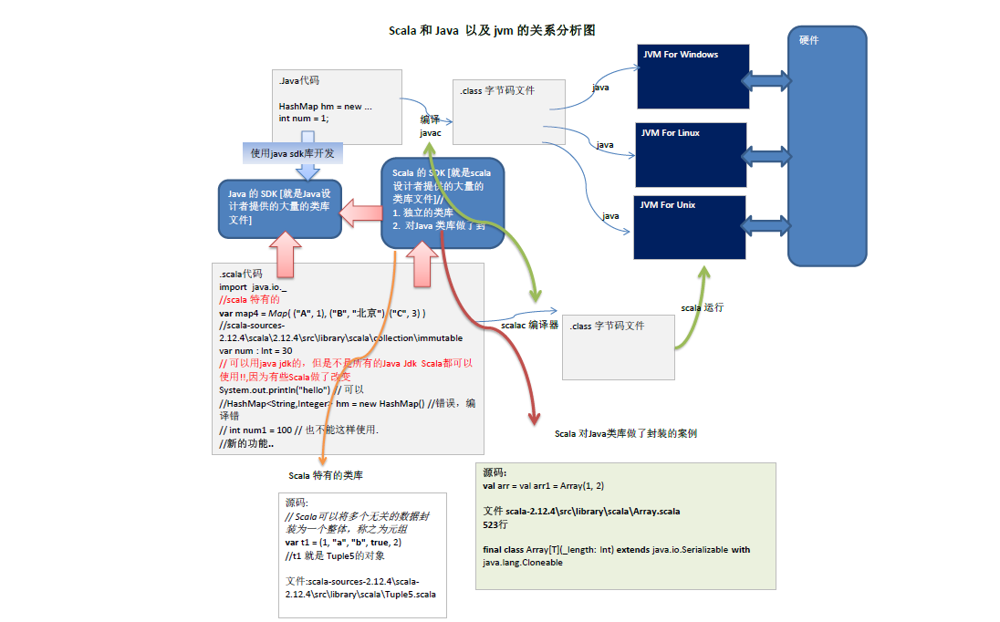
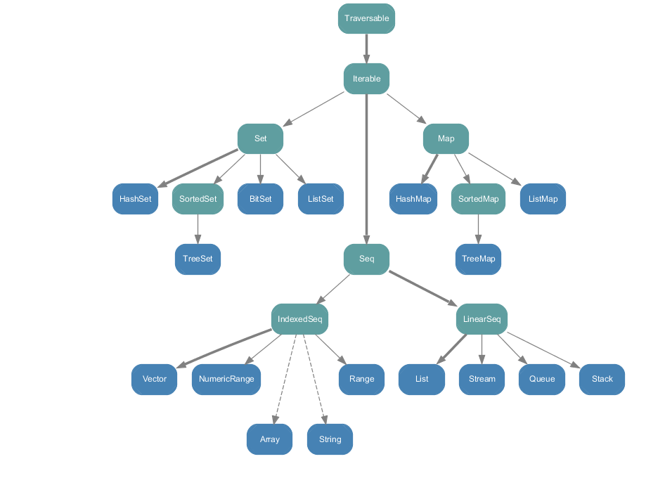
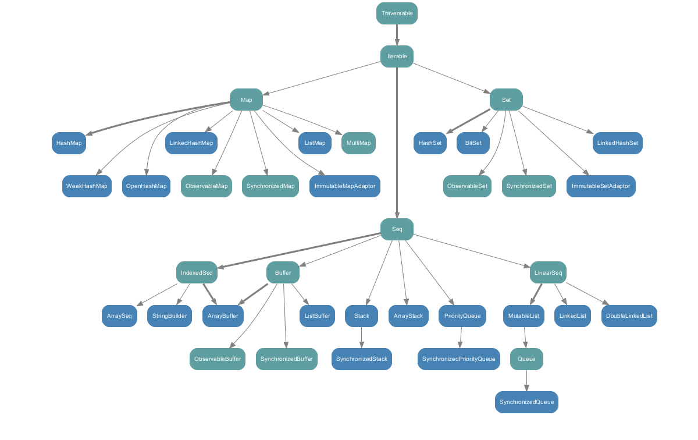

## 概述

##### Scala 语言的特点

> Scala 是一门多范式 (multi-paradigm) 的编程语言，支持面向对象和函数式编程
>
> Scala 源代码 (.scala) 会被编译成 Java 字节码 (.class) ，然后运行于 JVM 之上，并可以调用现有的 Java 类库，实现两种语言的无缝对接
>
> scala 单作为一门语言来看， 非常的简洁高效

##### Scala 与 Java 的关系



##### Scala 的 REPL

> scala 命令行窗口，称之为 REPL，Read -> Evaluation -> Print -> Loop，也称之为交互式解释器
>
> 在命令行窗口中输入scala指令代码时，解释器会读取指令代码（Read）并计算对应的值 (Evaluation) ，然后将结果打印出来 (Print) ，接着循环等待用户输入指令 (Loop)


## 基础语法

##### var 和 val

> 在声明/定义一个变量时，可以使用 var 或者 val 来修饰， var 修饰的变量可改变，val 修饰的变量不可改 
>
> val 修饰的变量在编译后，等同于加上 final
>
> var 修饰的对象引用可以改变，val 修饰的则不可改变，但对象的状态(值)却是可以改变的(比如: 自定义对象、数组、集合等等) 

##### while 循环的中断

> Scala 内置控制结构特地去掉了 break 和 continue，是为了更好的适应函数化编程，推荐使用函数式的风格解决 break 和 contine 的功能，而不是一个关键字

```scala
import util.control.Breaks._

var n: Int = 0
breakable{
  while(n <= 20){
    n += 1
    if(n == 18){
      break()
    }
  }
}
```

##### 惰性函数

> 当函数返回值被声明为 lazy 时，函数的执行将被推迟，直到我们首次对此取值。这种函数我们称之为惰性函数，在 Java 的某些框架代码中称之为懒加载(延迟加载)

```scala
def add(a: Int, b: Int) = a + b
// 此时函数并不会执行
lazy val res = add(10,20)
// 此时函数才会执行
println(res)
```

##### 异常

> Scala 提供 try 和 catch 块来处理异常

```scala
try {
    // 执行代码
}catch {
    // 各种异常，越具体的异常越要靠前，越普遍的异常越靠后
    // case ex: IllegalArgumentException => // 处理代码
    case ex: Exception => // 处理代码
}finally {
    // 执行代码
}
```

> 用 throw 关键字，抛出一个异常对象。所有异常都是 Throwable 的子类型。throw 表达式是有类型的，就是 Nothing，因为 Nothing 是所有类型的子类型，所以 throw 表达式可以用在需要类型的地方

```scala
def test(): Unit = throw new IllegalArgumentException("test.....")
```

> 在 Scala 中，可以使用 throws 注释来声明异常 
>
> 它向调用者函数提供了此方法可能引发此异常的信息，有助于调用函数处理并将该代码包含在 try-catch 块中，以避免程序异常终止。在scala中，可以使用throws注释来声明异常

```scala
// classOf[IllegalArgumentException] 等同于 IllegalArgumentException.class
@throws(classOf[IllegalArgumentException])
def test(): Unit = println("test....")
```


## 面向对象编程

#### 类

##### 内部类

> 内部类如果想要访问外部类的属性，可以通过外部类对象或外部类别名访问

```scala
class OuterClass {
  var name = "张三"

  class InnerClass {
    // 方式一：外部类名.this.属性名
    def info = println("name = " + OuterClass.this.name)
  }
}
```

```scala
class OuterClass {
  // 方式二(推荐)：给外部类对象声明别名
  outer =>

  class InnerClass {
    def info = println("name = " + outer.name)
  }
  // 被内部类访问的属性要声明在内部类之后
  var name = "lisi"
}
```

> <font color=red>注：Java 中的内部类从属于外部类，Scala 中内部类从属于实例</font>

```scala
// ================= java ================== 
class OuterClass {
    class InnerClass {}

    static class StaticInnerClass {}
}
// 创建对象
OuterClass outer = new OuterClass();
// 很诡异的写法
OuterClass.InnerClass inner = outer.new InnerClass();
OuterClass.StaticInnerClass staticInner = new OuterClass.StaticInnerClass();

// ================= scala ================== 
class OuterClass {
    class InnerClass {}
    // Scala中没有静态的概念，所以静态内部类不是放在类中声明，而是放置在类的伴生对象中声明
	// static class StatisInnerClass {}
}
object OuterClass {
	class StaticInnerClass {}
}
// 创建对象
val outer = new OuterClass()
val inner = new outer.InnerClass()
val staticInner = new OuterClass.StaticInnerClass()
```

##### 类型投影

> 在方法声明上，如果使用  <font color=#0099ff>外部类#内部类</font>  的方式，表示忽略内部类的对象关系
> 等同于Java中内部类的语法操作，我们将这种方式称之为 类型投影
> 即：忽略对象的创建方式，只考虑类型

```scala
def test(ic: OuterClass#InnerClass) {
    println(ic)
}

// 测试
val outer1: OuterClass = new OuterClass()
val outer1: OuterClass = new OuterClass()
val inner1: InnerClass = new outer1.InnerClass()
val inner2: InnerClass = new outer2.InnerClass()
// 在没有使用类型投影时会报错，使用类型投影过后正常
inner1.test(inner2)
```


#### 构造器

##### 主构造器

> 如果主构造器无参数，小括号可省略

1. <font color=#0099ff>主构造器参数不加修饰符</font>，那么这些参数是`局部变量`

   ```scala
   // 源码
   // 此处的 name 未加任何修饰，是局部变量，无法通过对象进行访问
   class Person(name: String) {
       var p_name: String = name
   }
   
   // 反编译
   public class Person {
       private String p_name;
   
       public Person(final String name) {
           this.p_name = name;
       }
       
       public String p_name() {
           return this.p_name;
       }
       
       public void p_name_$eq(final String x$1) {
           this.p_name = x$1;
       }
   }
   ```

2. <font color=#0099ff>主构造器参数添加 var 修饰符</font>，Scala 编译时会把参数添加为类的`成员属性`，提供其 `get/set 方法`，并`在有参构造初始化`

   ```scala
   // 源码
   class Person(var name: String) {
     var p_name: String = name
   }
   
   // 反编译
   public class Person {
       // name 成为了 Person 类的私有属性
       private String name;
       private String p_name;
   
       // 有参构造不仅给 p_name 赋了值，还给 name 属性赋了值
       public Person(final String name) {
           this.name = name;
           this.p_name = this.name();
       }
       
       public String name() {
           return this.name;
       }
       
       public void name_$eq(final String x$1) {
           this.name = x$1;
       }
       
       public String p_name() {
           return this.p_name;
       }
       
       public void p_name_$eq(final String x$1) {
           this.p_name = x$1;
       }
   }
   ```

3. <font color=#0099ff>主构造器参数添加 val 修饰符</font>，Scala 编译时会把参数添加为类的`只读属性`，提供其 `get 方法`，并`在有参构造初始化`

   ```scala
   // 源码
   class Person(val name: String) {
     var p_name: String = name
   }
   
   // 反编译
   public class Person {
       // 构造器的参数 name 变成了类的 final 私有属性
       private final String name;
       private String p_name;
   
       public Person(final String name) {
           this.name = name;
           this.p_name = name;
       }
       
       public String name() {
           return this.name;
       }
       
       public String p_name() {
           return this.p_name;
       }
       
       public void p_name_$eq(final String x$1) {
           this.p_name = x$1;
       }
   }
   ```

##### 辅助构造器

> 辅助构造器名称为 this（这个和Java是不一样的），多个辅助构造器通过不同参数列表进行区分
>
> 辅助构造器无论是直接或间接，最终都一定要调用主构造器，执行主构造器的逻辑，否则会报错

```scala
class Person() {
  var p_name: String = _
  var p_age: Int = _

  def this(name: String) {
    // 放在第一行
    this()
    p_name = name
  }

  def this(name: String, age: Int) {
    //调用之前已经声明过该构造器
    this(name)
    p_age = age
  }
}
```

##### 构造器私有化

> 主构造器私有化后，只能通过辅助构造器来构造对象
>
> 辅助构造器不能私有化

```scala
class Person private() {}

// 运行会报错
val person = new Person
```


#### 单例对象

> Scala 中没有静态的概念，所以为了实现 Java 中单例模式的功能，可以直接采用类对象（即伴生对象）方式构建单例对象，也就是伴生对象就是一个单例对象

```scala
object Calc {
  val name: String = "计算器"

  def add(a: Int, b: Int): Int = a + b
}
```

```scala
// 面试题：Java 单例模式举例
public class Runtime {
    private static Runtime currentRuntime = new Runtime();

    public static Runtime getRuntime() {
        return currentRuntime;
    }

    private Runtime() {
    }
    
    // ...
}
```


#### 伴生对象

1. Scala 中伴生对象采用 object 关键字声明，伴生对象中声明的全是 "静态"内容，可以通过伴生对象名称直接调用

2. 伴生对象对应的类称之为伴生类，伴生对象的名称应该和伴生类名一致

3. 伴生对象中的属性和方法都可以通过伴生对象名(类名)直接调用访问

4. 从语法角度来讲，所谓的伴生对象其实就是类的静态方法和静态成员的集合

5. 从技术角度来讲，Scala 还是没有生成静态的内容，只不过是将伴生对象生成了一个新的类，实现属性的 get 方法的调用

6. 伴生对象的声明应该和伴生类的声明在同一个源码文件中(如果不在同一个文件中会运行错误!)，但是如果没有伴生类，也就没有所谓的伴生对象了，所以放在哪里就无所谓了

7. 如果 class A 独立存在，那么 A 就是一个类， 如果 object A 独立存在，那么 A 就是一个"静态"性质的对象[即类对象], 在 object A 中声明的属性和方法可以通过 A.属性 和 A.方法 来实现调用

8. 当一个文件中，存在伴生类和伴生对象时，文件的图标会发生变化

   ```scala
   // 示例
   // 伴生类
   class Person {
     var name: String = _
     var age: Int = _
   }
   
   // 伴生对象
   object Person {
     var city: String = "北京"
   }
   ```


#### 枚举对象

> Scala 中没有枚举类型，定义一个扩展 Enumeration 类的对象，并以 Value 调用初始化枚举中的所有可能值,模拟枚举类型

```scala
object LightColorEnum extends Enumeration {
  val Red = Value(0, "Stop")
  val Yellow = Value(1, "Slow")
  val Green = Value(2, "Go")
}
```


#### 属性

1. 创建 var 修饰的属性后，Scala 默认会提供一对公有的 get/set 方法 [ attribute()/attribute_$eq(parameters) ]，并将属性声明为私有的 private

   ```scala
   // 源码
   class Person {
     var age: Int = _
   }
   
   // 反编译
   public class Person {
     private int age;
     
     // Scala 的 set 方法
     public void age_$eq(int x$1) {
       this.age = x$1;
     }
     
     // Scala 的 get 方法
     public int age(){
       return this.age;
     }
   }
   ```

2. Scala 的 get/set 方法，分别叫 attribute 和 attribute_$eq

3. 使用 val 修饰的属性，Scala 只提供 get 方法

   ```scala
   // 源码
   class Person {
     val age: Int = 10
   }
   
   // 反编译
   public class Person {
     private final int age = 10;
       
     public int age() {
       return this.age;
     }
   }
   ```

4. 如果我们将属性声明为私有的 private，Scala 则会提供一对私有的 get/set 方法，只能自己编写一对 get/set 方法

   ```scala
   // 源码
   class Person {
     private var age: Int = _
   }
   
   // 反编译
   public class Person {
     private int age;
     
     private void age_$eq(int x$1) {
       this.age = x$1;
     }
     
     private int age() {
       return this.age;
     }
   }
   ```

5. 使用 @BeanProperty 属性，Scala 除了会提供一对自己的 get/set 方法，还会提供一对和 java 一样的 get/set 方法

   ```scala
   // 源码
   class Person {
     @BeanProperty var age: Int = _
   }
   
   // 反编译
   public class Person {
     private int age;
     
     public int getAge() {
       return age();
     }
     
     public void setAge(int x$1) {
       this.age = x$1;
     }
     
     public void age_$eq(int x$1) {
       this.age = x$1;
     }
     
     public int age() {
       return this.age;
     }
   }
   ```


#### 包

##### 包/作用域

> 包也可以像嵌套类那样嵌套使用（包中有包）
>
> 作用域原则：可以直接向上访问，即子包中直接访问父包中的内容(即作用域) 
>
> 源文件的目录和包之间并没有强制的关联关系
>
> 可以在同一个 .scala 文件中，声明多个并列的 package
>
> 包名可以相对也可以绝对，比如，访问 BeanProperty 的绝对路径是： \_root\_. scala.beans.BeanProperty

```scala
package com.test
class Person {}

// =================== 等同于 ===================
package com
package test
class Person {}

// =================== 等同于 ===================
package com {
  package test {
    class Person {}
  }
}
```

##### 包对象

> 在 Java 中，包不能`包含函数或变量`的定义，为了弥补这一点不足，Scala 提供了包对象来解决这个问题

```scala
package com {
  package test {
    class Person {}
  }
    
  // 每个包都可以有一个包对象，需要在父包中定义它,且名称与子包一样
  package object test {
    var name = "张三"
  }
}
```

##### 包可见性

> 当访问权限缺省时，Scala 默认为 <font color=#0099ff>public</font> 访问权限
>
> 当访问权限为 private 时，只在类的内部和伴生对象中可用
>
> 当访问权限为 protected 时，只能子类访问，同包无法访问

```scala
package com.test
class Person {
  // 增加包访问权限后，private 同时起作用
  private[test] val p_name = "张三" 
  // 也可以将可见度延展到上层包
  private[com] val description = "张三"
}
```

##### 引入

> 如果不想要某个包中全部的类，而是其中的几个类，可以采用选取器(大括号)

```scala
def test (): Unit = {
  import scala.collection.mutable.{HashMap, HashSet}
  var map = new HashMap ()
  var set = new HashSet ()
}
```

##### 重命名和隐藏

> 如果引入的多个包中含有相同的类，那么可以进行重命名进行区分

```scala
import java.util.{ HashMap=>JavaHashMap, List}
import scala.collection.mutable._

// 此时的 HashMap 指向的是 scala 中的 HashMap
var map = new HashMap()
// 此时使用的 java 中 hashMap 的别名
var map1 = new JavaHashMap()
```

> 如果某个冲突的类根本就不会用到，那么这个类可以直接隐藏掉

```scala
import java.util.{HashMap => _, _}

// 此时的 HashMap 指向的是 scala 中的 HashMap
var map = new HashMap ()
```


#### 继承

##### 重写方法

> 重写一个非抽象方法需要用 <font color=#0099ff>override</font> 修饰符，调用超类的方法使用 <font color=#0099ff>super</font> 关键字
>
> 抽象属性重写时，可以不增加 override 关键字

```scala
class Person {
  def printName() { ... }
}

class Emp extends Person {
  override def printName() { ... }
}
```

##### 类型检查和转换

> classOf[String] 就如同 Java 的 String.class
>
> obj.<font color=#0099ff>isInstanceOf[T]</font> 就如同 Java 的 obj instanceof T
>
> obj.<font color=#0099ff>asInstanceOf[T]</font> 就如同 Java 的 (T)obj

```scala
println("Hello".isInstanceOf[String])
println("Hello".asInstanceOf[String])
println(classOf[String])
```

##### 超类的构造<font color=red> * </font>

> <font color=red>只有主构造器可以调用父类的构造器，辅助构造器不能直接调用父类的构造器</font>
>
> 在 Scala 的构造器中，<font color=red>不能使用 super(params) 调用超类构造</font>

```scala
class Animal {}
class Dog extends Animal {
    def this(name: String) {
        this()
        // ...
    }
}
// 1.先执行 extends Animal 的 Animal()
// 2.再执行 class Dog 类中的 主构造器 Dog()
// 3.再执行 Dog 的辅助构造器 this(name: String)
```

##### 覆写字段

> def 只能重写另一个 def (即：方法只能重写另一个方法)
>
> val 只能重写另一个 val 或 重写不带参数的 def
> 为什么编译器不支持 val 去重写 var 属性？原因是会造成数据设置和或者不一致
>
> var 只能重写另一个抽象的 var (声明未初始化的变量就是抽象的变量)


#### 特质 (Trait)

##### 使用方法

```scala
// (1) 没有父类
class 子类名 extends 特质1 with 特质2 with 特质3 {...}
// (2) 有父类
class 子类名 extends 父类 with 特质1 with 特质2 with 特质3 {...}
```

##### 特质的构造器执行顺序<font color=red> * </font>

1. 首先调用超类的构造器
2. 特质构造器在超类构造器之后、类构造器之前执行
3. 特质由左到右被构造
4. 每个特质中，父特质先被构造
5. 如果多个特质共有一个父特质，那么那个父特质已经被构造，则不会被再次构造
6. 所有特质构造完毕后，子类被构造

##### 自身类型

> 主要是为了解决特质的循环依赖问题，同时可以确保特质在不扩展某个类的情况下，依然可以做到限制混入该特质的类的类型

```scala
trait Logger {
  // 明确告诉编译器，我就是Exception
  this: Exception =>
  def log(): Unit = {
    // 既然我就是Exception, 那么就可以调用其中的方法
    println(getMessage)
  }
}
```


#### 隐式转换和隐式参数

##### 隐式转换函数

> 隐式转换函数是以 implicit 关键字声明的带有单个参数的函数，适用于<font color=#0099ff> 数据类型转换</font>
>
> 这种函数将会自动应用，将值从一种类型转换为另一种类型

```scala
/** 隐式转换函数定义方式 */
implicit def 函数名 (参数列表): 返回值类型 = {
	//函数体
}

// 示例
implicit def a (d: Double) = d.toInt
// (OK) 当发现程序有误时，Scala 编译器会尝试在隐式函数列表中查询可以进行转换的函数  
val i: Int = 3.5
```

> 隐式转换函数的函数名可以是任意的，隐式转换与函数名称无关，只与函数签名（函数参数类型和返回值类型）有关
>
> 需要保证在当前环境下，只有一个隐式函数能被识别

##### 利用隐式转换丰富类库功能

> 如果需要为一个类增加一个方法，可以通过隐式转换来实现

```scala
// 示例：为 MySQL 增加一个 delete 方法
class MySQL {
  def insert(id: Int): Unit = {
    println("向数据库中插入数据：" + id)
  }
}

class DB {
  def delete(id: Int): Unit = {
    println("从数据库中删除数据：" + id)
  }
}

val mysql = new MySQL
implicit def addFun (db: MySQL): DB = new DB ()
// mysql 增加了 delete 方法
mysql.delete (1)
```

##### 隐式类

> <font color=#0099ff>其所带的构造参数有且只能有一个</font>
>
> 隐式类必须被定义在“类”或“伴生对象”或“包对象”里
>
> 隐式类不能是 case class
>
> 作用域内不能有与之相同名称的标示符

```scala
object Test {
  implicit class toInt(x:Int) {
    // 为Int类，扩展一个add方法
    def add(a:Int,b:Int): Int = {
      return a + b
    }
  }
  
  def main(args: Array[String]): Unit = {
    val res: Int = 1.add(2,4)
    print(res)
  }
}
```

##### 隐式的转换时机

> 当方法中的参数的类型与目标类型不一致时
>
> 当对象调用所在类中不存在的方法或成员时，编译器会自动将对象进行隐式转换(根据类型)

##### 隐式解析机制

> 首先会在当前代码作用域下查找隐式实体(隐式方法、隐式类、隐式对象)
>
> 如果第一条规则查找隐式实体失败，会继续在隐式参数的类型的作用域里查找
> 类型的作用域是指与该类型相关联的全部伴生模块，一个隐式实体的类型T它的查找范围如下：
> ​	a) 如果 T 被定义为 T with A with B with C, 那么 A, B, C都是 T 的部分，在 T 的隐式解析过程中，它们的伴生对象都会被搜索
> ​	b) 如果 T 是参数化类型，那么类型参数和与类型参数相关联的部分都算作T的部分，比如 List[String] 的隐式搜索会搜索 List 的伴生对象和 String 的伴生对象
> ​	c) 如果 T 是一个单例类型 p.T，即 T 是属于某个 p 对象内，那么这个 p 对象也会被搜索。
> ​	d) 如果 T 是个类型注入 S#T，那么 S 和 T 都会被搜索


## 数组与集合

#### 集合继承关系图

##### 不可变集合



##### 可变集合




#### 数组 (Array)

##### 定长数组

1. 创建

   ```scala
   // 方式一
   val array = Array(1,2,3)
   
   // 方式二
   val array = new Array[Int](3)
   ```

2. 操作

   ```scala
   // (1) 赋值
   array(0) = 99
   
   // (2) 转换为变长数组
   val ab = array.toBuffer
   ```

##### 变长数组

1.  创建

   ```scala
   // 方式一
   import scala.collection.mutable.ArrayBuffer
   val array = new ArrayBuffer[Int]()
   
   // 方式二
   val array = ArrayBuffer(1,2,3)
   ```

2. 操作

   ```scala
   // (1) += 在尾端添加一个元素，多个元素用（）包起来
   array += 11
   array += (11,2,3,5)
   
   // (2) ++= 在尾端添加集合
   array ++= Array(4,5,6)
   
   // (3) trimStart(n)/trimEnd(n) 移除最 前/后 n个元素
   array.trimEnd(2)
   
   // (4) insert(n,x) 在下标为n的位置插入单个元素x
   array.insert(2,99)
   
   // (5) insert(n,x1,x2,x3,..) 在下标为n的位置插入多个元素x1,x2,x3,.. 
   array.insert(2,44,55,66)
   
   // (6) remove(index) 移除下标为i的位置的元素
   array.remove(1)
   
   // (7) remove(index,n) 移除下标为i的位置开始的n个元素(包括i) 
   array.remove(1,4)
   
   // (8) toArray() 转换为长度不可变数组
   val arr = array.toArray
   ```

##### 遍历数组

1. 使用下标遍历

   ```scala
   for (index <- 0 to array.length - 1) { println(array(index)) }
   ```

2. 不使用下标遍历

   ```scala
   for (item <- array) { println(item) }
   ```

##### yield 推导新数组

```scala
val arr = for(item <- array) yield item * 2
```

##### 常用函数

```scala
// (1) sum
array.sum

// (2) max/min
array.max

// (3) sorted 排序
array.sorted

// (4) reverse 反转
array.reverse
```

##### 多维数组

```scala
// 说明：二维数组中有三个一维数组，每个一维数组中有四个元素
val arr = Array.ofDim[Double](3,4)
```

##### Scala 数组与 Java 数组互转

1. Scala 数组转 Java 数组 (List)

   ```scala
   val arr = ArrayBuffer("1", "2", "3")
   
   // 下面的 import 引入了我们需要的隐式函数 【这里就是隐式函数的应用】
   // implicit def bufferAsJavaList[A](b : scala.collection.mutable.Buffer[A]) : java.util.List[A]
   import scala.collection.JavaConversions.bufferAsJavaList
   
   // 这里使用了我们的隐式函数 bufferAsJavaList 完成两个 ArrayBuffer -> List 转换
   val javaArr = new ProcessBuilder(arr)
   // 返回的是 List<String>
   val arrList = javaArr.command()
   // 输出 [1, 2, 3]
   println(arrList)
   ```

2. Java 数组 (List) 转 Scala 数组

   ```scala
   import scala.collection.JavaConversions.asScalaBuffer
   import scala.collection.mutable
   
   // java.util.List ==> Buffer
   val scalaArr: mutable.Buffer[String] = arrList
   ```


#### 元组 (Tuple)

> 元组可以存入多个不同类型的值, 目前 Scala 支持的元组最大长度为 22

##### 创建

```scala
// 方式一
val t1 = (1,2.0,"lisi")

// 方式二	可以通过a,b,c直接访问对应元素
val t1,(a,b,c) = ("zhangsan","lisi","wangwu")

// 方式三	Tuple1,Tuple2,Tuple3...
val tuple = Tuple3(1, 2, 3)
```

##### 查询

```scala
// 方式一 通过顺序号(_1,_2,_3,...)
t1._1

// 方式二 通过索引(productElement(index))
t1.productElement(1)

// 方式三 通过别名
scala> val t1,(a,b,c) = ("zhangsan","lisi","wangwu")
scala> a
res0: String = zhangsan
```

##### 遍历

```scala
for (item <- t1.productIterator) { println("item = " + item) }
```


#### 列表 (List)

##### 不可变列表

1. 创建

   ```scala
   val list = List(1,2,4)
   // Nil -> 空List集合
   ```

2. 操作

   ```scala
   // (1) +: 将元素插入到集合前，生成新集合
   val list1 = 22 +: list
   
   // (2) :+ 将元素插入到集合后，生成新集合
   val list2 = list :+ 99
   
   // (3) ++ 将两个集合合并成一个新的集合
   val list3 = list1 ++ list2
   
   // (4) ++: 将集合lsit1插入list2前面，生成新集合
   val list4 = list1 ++: list2
   
   // (5) :: 将给定的头和尾链接起来，创建一个新的列表
   9 :: List(5, 2)
   9 :: 5 :: 2 :: Nil
   
   // (6) ::: 将集合中的每一个元素加入到空集合中去[要求::: 左右两边都是集合]
   val list6 = list1 ::: Nil
   
   // (7) .:::() 将集合lsit1插入list2后面，生成新集合
   val list5 = list1.:::(list2)
   ```

##### 可变列表

1. 创建

   ```scala
   // 方式一
   import scala.collection.mutable.ListBuffer
   val list = ListBuffer(1, 2, 3)
   
   // 方式二
   import scala.collection.mutable.ListBuffer
   val list = new ListBuffer[Int]()
   ```

2. 操作

   ```scala
   // (1) += 将元素插入到集合后，多个元素用 () 包起来
   list += 4
   
   // (2) append 将元素插入到集合后
   list.append(5)
   
   // (3) ++= 将集合list2追加到list1中(没有生成新的集合)
   list1 ++= list2
   
   // (4) ++ 将list1和list2合并成一个新的集合
   val list3 = list1 ++ list2
   
   // (5) :+ 将元素插入到集合后，并生成新的集合
   val list4 = list :+ 88
   
   // (6) +: 将元素插入到集合前，并生成新的集合
   val list5 = 99 +: list
   
   // (7) ++: 将集合lsit1插入list2前面，生成新集合
   val list6 = list1 ++: list2
   ```


#### 队列 (Queue)

##### 不可变队列

1. 创建

   ```scala
   import scala.collection.immutable.Queue
   val queue = Queue(1,2,3)
   ```

2. 操作

   ```scala
   // (1) +: 将元素插入到集合前，生成新集合
   val queue1 = 22 +: queue
   
   // (2) :+ 将元素插入到集合后，生成新集合
   val queue2 = queue :+ 99
   
   // (3) ++ 将两个集合合并成一个新的集合
   val queue3 = queue1 ++ queue2
   
   // (4) ++: 将集合lsit1插入list2前面，生成新集合
   val queue4 = queue1 ++: queue2
   ```

##### 可变队列

1. 创建

   ```scala
   // 方式一
   import scala.collection.mutable.Queue
   val queue1 = Queue(1,2,3)
   
   // 方式二
   import scala.collection.mutable.Queue
   val queue2 = new Queue[Int]()
   ```

2. 操作

   ```scala
   // (1) += 将元素插入到集合后，多个元素用 () 包起来
   queue += 4
   
   // (2) ++= 将集合queue2追加到queue1中(没有生成新的集合)
   queue1 ++= queue2
   
   // (4) ++ 将list1和list2合并成一个新的集合
   val queue3 = queue1 ++ queue2
   
   // (5) :+ 将元素插入到集合后，并生成新的集合
   val queue4 = queue :+ 88
   
   // (5) +: 将元素插入到集合前，并生成新的集合
   val queue5 = 99 +: queue
   
   // (6) ++: 将集合lsit1插入list2前面，生成新集合
   val queue4 = queue1 ++: queue2
   ```

##### 队列常用方法

```scala
// (1) dequeue 删除第一个元素，返回删除的元素
queue.dequeue()

// (2) enqueue 添加元素到队尾
// immutable.Queue.enqueue[B >: A](elem: B)
// immutable.Queue.enqueue[B >: A](iter: Iterable[B])
// mmutable.Queue.enqueue(elems: A*)
queue.(4)

// (3) head 返回队列的第一个元素
queue.head

// (4) last 返回队列的最后一个元素
queue.last

// (5) tail 返回队列除第一个元素以外的所有元素
queue.tail
```


#### 映射 (Map)

##### 不可变映射

1. 创建

   ```scala
   // 方式一
   val map = Map("001" -> "lisi","002" -> "wangwu")
   
   // 方式二
   import scala.collection.immutable.HashMap
   val map = new HashMap()
   // --> map: scala.collection.immutable.HashMap[Nothing,Nothing] = Map()
   ```

2. 操作

   ```scala
   // (1) + 添加/修改 一个元素(key 无则添加，有则修改 value)
   map + ("003" -> "libai")
   
   // (2) - 删除一个元素
   map - "001"
   ```

##### 可变映射

1. 创建

   ```scala
   // 方式一
   import scala.collection.mutable.Map
   val map = Map("001" -> "zhangsan","002" -> "lisi")
   
   // 方式二
   import scala.collection.mutable.HashMap
   val map = new HashMap()
   // --> map: scala.collection.mutable.HashMap[Nothing,Nothing] = Map()
   ```

2. 操作

   ```scala
   // (1) 更新映射中的值
   // 方式一
   map.put("002","nanjing")
   // 方式二
   map("002") = "nanjing1"
   
   // (2) 添加数据
   // 方式一
   map.put("003","dongjing")
   // 方式二
   map("004") = "xijing"
   // 方式三
   map += ("005" -> "tianjing")
   
   // (3) 删除数据
   map -= "001"
   ```

##### Map 取值

```scala
/** 方式一 map(key)
 * 1) 如果 key 存在，则返回对应的值
 * 2) 如果 key 不存在，则抛出异常
 * 3) 在 Java 中,如果 key 不存在则返回 null
 */
val value = map("001")

/** 方式二 map.get(key)
 * 返回一个 Option 对象，要么是 Some，要么是 None
 */
println(map.get("001"))

/** 方式三 map.getOrElse()
 * 1) 如果 key 存在，返回 key 对应的值
 * 2) 如果 key 不存在，返回默认值
 */
println(map.getOrElse("001","default_value"))

/** 方式四 contains 检查 key 是否存在
 * 1) 如果 key 存在，则返回 true
 * 2) 如果 key 不存在，则返回 false
 */
if (map.contains("001")) println("存在" + map("001"))
else println("key 不存在")
```

##### 遍历

```scala
// 方式一 for((x,y) <- map)
for((x,y) <- map) { println(x + " -> " + y) }

// 方式二 keySet
val keyset = map.keySet
for(i <- keyset) { println(i + " -> " + map(i)) }

// 方式三
for (k <- map.keys) print("key = " + k + "\t")
for (v <- map.values) print("value = " + v + "\t")
```


#### 集合 (Set)

##### 不可变集合

1. 创建

   ```scala
   val set = Set(1,2,3)
   ```

2. 操作

   ```scala
   // (1) + 在集合中添加元素(生成新集合)
   val set2 = set + 4
   
   // (2) ++ 在集合中添加集合(生成新集合)
   val set3 = set ++ set2
   ```

##### 可变集合

1. 创建

   ```scala
   import scala.collection.mutable.Set
   val set = Set(1,2,3)
   ```

2. 操作

   ```scala
   // (1) += 添加元素，多个元素用（）包起来
   set += 4
   
   // (2) add 返回值：Boolean
   set.add(5)
   set add 6
   
   // (3) ++= 追加一个Set集合(没有创建新集合)
   set ++= set1
   
   // (4) -= 删除元素，多个元素用（）包起来
   set -= 1
   
   // (5) remove(element) 删除一个元素
   set.remove(2)
   ```


#### Iterable 常用方法

##### foreach

```scala
list.foreach(x => println(x))
map.foreach(x => println(x._1 + " -> " + x._2))
```

##### Iterator

```scala
val iterator = List(1, 2, 3, 4, 5).iterator
while (iterator.hasNext) {
  println(iterator.next())
}
```

##### filter

```scala
// 过滤不满足传入函数(false)的元素,返回新集合
val res = list.filter(x => x % 2 == 0)
```

##### flatten

> 扁平化处理

```scala
val list = List(list1,list2)
// list: List[List[Int]] = List(List(1, 2, 3), List(4, 5, 6))
val res = list.flatten
// List(1, 2, 3, 4, 5, 6)
```

##### diff/intersect/union

> 差集、交集和并集，并集不去重

```scala
val list1 = List(1,2,3,4,5,6)
val list2 = List(4,5,6,7,8,9)
val diff_res = list1 diff list2				// List(1, 2, 3)
val intersect_res = list1 intersect list2	// List(4, 5, 6)
val union_res = list1 union list2			// List(1, 2, 3, 4, 5, 6, 4, 5, 6, 7, 8, 9)
```

##### map

```scala
List(1, 2, 3, 4).map(x => x * 2)
// List[Int] = List(2, 4, 6, 8)
```

##### flatMap

> 等价先 map 再 flatten

```scala
List(a b c, a b, c d).flatMap(x => x.split(" "))
// List[String] = List(a, b, c, a, b, c, d)
```

##### zip

> 拉链操作

```scala
val arr1 = Array(1,2,3)
val arr2 = Array("zhangsan","lisi","wangwu")
val res = arr1 zip arr2
// Array[(String, Int)] = Array((zhangsan,1), (lisi,2), (wangwu,3))
```

##### forall

> 对整个集合进行条件检查，只要一个元素返回 false，则最后结果为 false

```scala
val arr = Array(1,2,3)
val res = arr.forall(x => x > 2)	// false
```

##### partition

> 对集合按条件分组

```scala
val arr = Array(1,2,3,5,6,2,5)
val res = arr.partition(x => x % 2 == 0)
// (Array[Int], Array[Int]) = (Array(2, 6, 2),Array(1, 3, 5, 5))
```

##### reduce/reduceLeft/reduceRight

```scala
val arr = Array(1,2,3)
// Int = -4
val res1 = arr.reduce((x,y) => x - y)
// Int = -4
val res2 = arr.reduceLeft((x,y) => x - y)
// Int = 2	-> (1,(2,3))
val res3 = arr.reduceRight((x,y) => x - y)
```

##### fold/foldLeft/foldRight

> 可以把reduceLeft看做简化版的foldLeft
>
> def reduceLeft[B >: A](@deprecatedName('f) op: (B, A) => B): B =
>
> ​	if (isEmpty) throw new UnsupportedOperationException("empty.reduceLeft")
> ​	else tail.foldLeft[B](head)(op)
>
> /:	-->	等同于 foldLeft
>
> :\	-->	等同于 foldRight

```scala
val arr = List(1, 2, 3, 4)
// -5 -> (((5, 1), 2), 3, 4)
val res1 = arr.foldLeft(5)((x,y) => x - y)
val res1 = (5 /: arr)((x,y) => x - y)
// 3 -> (1, (2, (3, (4, 5))))
val res2 = arr.foldRight(5)((x,y) => x - y)
val res1 = (arr :\ 5)((x,y) => x - y)
```

##### scan/scanLeft/scanRight

> 对某个集合的所有元素做 fold 操作，但是会把产生的所有中间结果放置于一个集合中保存

```scala
// Vector(5, 4, 2, -1, -5, -10)
(1 to 5).scanLeft(5)((x,y) => x - y)
// Vector(5, 6, 8, 11, 15, 20)
(1 to 5).scanLeft(5)((x,y) => x + y)
```

##### groupBy/grouped

```scala
/** groupBy 返回一个新的Map集合，按照key将元素进行分组 */
List("boy" -> "xiaobei", "boy" -> "xiaonan", "girl" -> "xiaotian").groupBy(x => x._1)
//	Map(girl -> List((girl,xiaotian)), boy -> List((boy,xiaobei), (boy,xiaonan)))

/** grouped 根据给定的长度n, 进行分组, 每n个元素分为一组 */
Array(1,2,3,4,5).grouped(2)	// 返回值是 Iterator[Array[Int]]
```

##### mapValues

> 在Map数据结构里，对value进行操作

```scala
// Map(dog -> 3, cat -> 2)
Map("dog" -> List(1, 2, 4), "cat" -> List(2, 3)).mapValues(x => x.size)
```

##### stream

> stream 是一个集合。这个集合，可以用于存放无穷多个元素，但是这无穷个元素并不会一次性生产出来，而是需要用到多大的区间，就会动态的生产，末尾元素遵循 lazy 规则(即：要使用结果才进行计算)

```scala
// 创建的集合的第一个元素是 n, 后续元素生成的规则是 n + 1
def numsForm(n: BigInt) : Stream[BigInt] = n #:: numsForm(n + 1)

val stream = numsForm(1)
println("stream = " + stream)
// 希望再取一个流集合数据
// (2,?)，tail 表示返回除了第一个以外剩余的元素
println(stream.tail)
// (1,2,?)
println("stream =" + stream)
println("stream.head=" + stream.head)
// 死循环，last 表示返回集合最后一个元素
// println("stream.last" + stream.last)
```

##### view

> view 方法产出一个总是被懒执行的集合

```scala
val view = (1 to 5).view.scanLeft(5)((x,y) => x - y)
// SeqViewC(...)
println(view)
// 5 4 2 -1 -5 -10 
for (item <- res) print(item + " ")
```


## 模式匹配

##### match

> 从第一个 case 分支开始匹配，如果匹配成功，那么执行对应的逻辑代码
>
> 每个case中，不用 break 语句，自动中断 case
>
> 如果匹配不成功，继续执行下一个分支进行判断
>
> 如果所有 case 都不匹配，那么会执行 case _ 分支，类似于 Java 中 default 语句
>
> 如果没有任何模式匹配成功，那么会抛出 MatchError

```scala
val op: Char = '-'
op match {
  case '+' => result = 1
  case '-' => result = -1
  case _ => result = 0
}
```

##### 守卫

> 如果想要表达匹配某个范围的数据，就需要在模式匹配中增加条件守卫

```scala
for (ch <- "+-3!") {
  var sign = 0
  var digit = 0
  ch match {
    case '+' => sign = 1
    case '-' => sign = -1
    case _ if ch.toString.equals("3") => digit = 3
    case _ => sign = 0
  }
  println(ch + " " + sign + " " + digit)
}
```

##### 模式中的变量

> 如果在 case 关键字后跟变量名，那么 match 前表达式的值会赋给那个变量

```scala
val str = "+-3!"
for (i <- str.indices) {
  //有效索引集合
  var sign = 0
  var digit = 0

  str(i) match {
    case '+' => sign = 1
    case '-' => sign = -1
    case ch if Character.isDigit(ch) => digit = Character.digit(ch, 10)
    case _ =>
  }
  println(str(i) + " " + sign + " " + digit)
}
```

##### 类型匹配

> 可以匹配对象的任意类型，这样做避免了使用 isInstanceOf 和 asInstanceOf 方法
>
> 类型不能直接匹配泛型类型

```scala
val r1 = obj match {
    case x: Int => x
    case s: String => s.toInt
    case _: BigInt => Int.MaxValue
    case m: Map[String, Int] => "Map[String, Int]类型的Map集合"
    case a: Array[String] => "It's an Array[String]"
    case _ => 0
}
```

##### 匹配数组

> Array(0) 匹配只有一个元素且为 0 的数组
>
> Array(x,y) 匹配数组有两个元素，并将两个元素赋值给 x 和 y
>
> Array(0,_*) 匹配数组以 0 开始

```scala
for (arr <- Array(Array(0), Array(1, 0), Array(0, 1, 0), Array(1, 1, 0), Array(1, 1, 0, 1))) {
  val result = arr match {
    case Array(0) => "0"
    case Array(x, y) => x + " " + y
    case Array(x, y, z) => x + " " + y + " " + z
    case Array(0, _*) => "0..."
    case _ => "something else"
  }
  println(result)
}
```

##### 匹配列表

> 0 :: Nil 匹配只有一个元素且为 0 的列表
> x :: y :: Nil 匹配列表有两个元素，并将两个元素赋值给 x 和 y
> 0 :: tail 匹配列表以 0 开始

```scala
for (list <- Array(List(0), List(1, 0), List(0, 0, 0), List(1, 0, 0))) {
  val result = list match {
    case 0 :: Nil => "0"
    case x :: y :: Nil => x + " " + y
    case 0 :: tail => "0 ..."
    case _ => "something else"
  }
  println(result)
}
```

##### 匹配元组

> (0, _) 匹配第一个元素为 0 的元组，第二个元素随意
>
> (y, 0) 匹配第二个元素为 0 的元组，并将第一个元素赋值给 y

```scala
for (pair <- Array((0, 1), (1, 0), (1, 1))) {
  val result = pair match {
    case (0, _) => "0 ..."
    case (y, 0) => y + " 0"
    case _ => "neither is 0"
  }
  println(result)
}
```

##### 对象匹配

> case 中对象的 unapply 方法返回 some 集合则为匹配成功，返回 none 集合则为匹配失败

```scala
object Square {
  def unapply(z: Double): Option[Double] = Some(math.sqrt(z))
}

// 模式匹配使用
val number: Double = 36.0
number match {
  case Square(n) => println(n)
  case _ => println("nothing matched")
}
```

##### 样例类

> 样例类用 case 关键字进行声明

```scala
// =============== 声明样例类 ====================
abstract class Amount
case class Dollar(value: Double) extends Amount
case class Currency(value: Double, unit: String) extends Amount
case object Nothing extends Amount

// ================= 使用 ======================
for (amt <- Array(Dollar(1000.0), Currency(1000.0, "EUR"), Nothing)) {
  val result = amt match {
    case Dollar(v) => "$" + v
    case Currency(_, u) => u
    case Nothing => ""
  }
  println(amt + " : " + result)
}
```

<font color=#0099ff>当声明样例类时，如下几件事情会自动发生</font>

1. 构造器中的每一个参数都成为 val —— 除非它被显式地声明为 var (不建议这样做)

2. 伴生对象中提供的 apply 方法使不用 new 关键字就能构造出相应的对象，比如Dollar(29.95)或Currency(29.95, "EUR")

3. 提供 unapply 方法让模式匹配可以工作

4. 将生成 toString、equals、hashCode 和 copy 方法——除非显式地给出这些方法的定义

   <font color=#8B8B7A>copy 方法创建一个与现有对象值相同的新对象，并可以通过带名参数来修改某些属性</font>

##### 密封类

> 如果想让 case 类的所有子类都必须在申明该类的相同的源文件中定义，可以将样例类的通用超类声明为 sealed，这个超类称之为密封类，密封就是不能在其他文件中定义子类

##### 偏函数

> 将包在大括号内的一组 case 语句封装为函数，我们称之为偏函数，它只对会作用于指定类型的参数或指定范围值的参数实施计算，超出范围的值会忽略(未必会忽略，这取决于你打算怎样处理)
>
> 偏函数在 Scala 中是一个特质 PartialFunction

```scala
// ====================== 实现偏函数 =======================
// 定义一个将List集合里面数字加1的偏函数
// 构建特质的实现类
// [Any, Int]是泛型，第一个表示参数类型，第二个表示返回参数
val addOne = new PartialFunction[Any, Int] {
  def apply(any: Any) = any.asInstanceOf[Int] + 1
  def isDefinedAt(any: Any) = if (any.isInstanceOf[Int]) true else false
}

val list1 = list.map(addOne) // (X) map函数不支持偏函数
val list1 = list.collect(addOne) // OK collect函数支持偏函数
println(list1)

// ====================== 简单的实现方法 =======================
def f2: PartialFunction[Any, Int] = {
  // case语句可以自动转换为偏函数
  case i: Int => i + 1
}
val rf2 = List(1, 2, 3, 4, "ABC") collect f2
println(rf2)

// ====================== 简化 =======================
val rf2 = List(1, 2, 3, 4, "ABC") collect { case i: Int => i + 1 }
println(rf2)
```


## 函数式编程

##### 函数的定义

```scala
def 函数名（参数名[：参数类型]…）[: 返回值类型 = ] { 函数体 }
/** 如果函数中无返回值，那么返回值类型无需声明
 *  如果函数中有返回值，且使用 return 关键字声明，那么返回值类型需要声明
 *  如果函数有返回值，但是返回值类型没有声明，那么方法返回值由 Scala 自行推断
 *  函数调用 : 函数名()，如果函数无参数列表，那么小括号可以省略
 */

// ======================= 函数赋给变量 =========================
def add(a: Int, b: Int): Int = {
  a + b
}
val test = add _
// 3
println(test(1, 2))

// ======================= Lambda匿名函数 =========================
// 1. val 函数名 = (参数列表) => { //函数体  }
val add = (a: Int, b: Int) => a + b

// 2. val 函数名: ((参数类型1,参数类型2,.) => 返回值类型) = {(参数1,参数2,.) => {...}
val add: ((Int, Int) => Int) = (x, y) => x + y
```

##### 过程

> 将函数的返回类型为 Unit 的函数称之为过程(procedure)，如果明确函数没有返回值，那么等号可以省略
>
> 开发工具的自动代码补全功能，虽然会自动加上 Unit，但是考虑到 Scala 语言的简单、灵活，能不加最好不加

##### 高阶函数

```scala
// ======================= 1.函数作为参数 =========================
def add(a: Int, b: Int): Int = a + b
def func(a: Int, b: Int, f: (Int, Int) => Int): Unit = print(f(a, b))

// ======================= 2.返回值为函数 =========================
def toUp(str: String): String = str.toUpperCase
def toLo(str: String): String = str.toLowerCase
def func(flag: Boolean): String => String = if (flag) toUp else toLo
```

##### 闭包

> 闭包就是能够读取其他函数内部变量的函数，在本质上，闭包是将函数内部和函数外部连接起来的桥梁

```scala
def minus(x: Int) = (y: Int) => x - y
// 20 赋给x，f 函数就是闭包
val f = minus(20)

// 示例
def makeSuffix(suffix: String) = {
    // 1. 返回的是一个匿名函数
    // 2. 该匿名函数使用到 外部的变化 suffix
    // 3. 那么匿名函数和外部的suffix 共同构成一个整体，我们称为闭包
    (name:String) => {
    	if (name.endsWith(suffix)) name
		else name + suffix
      }
}
```

##### 函数柯里化

> 函数编程中，接受多个参数的函数都可以转化为接受单个参数的函数，这个转化过程就叫柯里化。
> 柯里化就是证明了函数只需要一个参数而已

```scala
def mul(x: Int, y: Int) = x * y
println(mul(10, 10))

def mulCurry(x: Int) = (y: Int) => x * y
println(mulCurry(10)(9))

def mulCurry2(x: Int)(y: Int) = x * y
println(mulCurry2(10)(8))
```

##### 控制抽象

> 控制抽象是一类函数：
> 1、参数是函数
> 2、函数参数没有输入值也没有返回值

```scala
// 示例
def runInThread(f1: () => Unit): Unit = {
  new Thread {
    override def run(): Unit = f1()
  }.start()
}

runInThread {
  () =>
    println("干活咯！")
    Thread.sleep(5000)
    println("干完咯！")
}
```


## 注解

##### 什么可以被注解

```scala
// 1.可以为类，方法，字段局部变量，参数，表达式，类型参数以及各种类型定义添加注解
@Entity class Student
@Test def play() {}
@BeanProperty var username = _
def doSomething(@NotNull message: String) {}
@BeanProperty @Id var username = _

// 2.构造器注解，需要在主构造器之前，类名之后，且需要加括号，如果注解有参数，则写在注解括号里
class Student @Inject() (var username: String, var password: String)

// 3.为表达式添加注解，在表达式后添加冒号
（map.get(key): @unchecked) match { ... }

// 4.泛型添加注解
class Student[@specialized T]

// 5.实际类型添加注解
String @cps[Unit]
```

##### 注解实现

> 可以自定义注解，但是更多的是使用 Scala 和 Java 提供的注解

```scala
// 自定义注解
class unchecked extends annotation.Annotation { ... }
```

##### 针对 Java 的注解

```scala
/** 1.Java修饰符：对于那些不是很常用的 Java 特性，Scala 使用注解，而不是修饰符关键字 */
// JVM 中将成为 volatile 的字段
@volatile var done = false
// 在 JVM 中将成为 transient 字段，该字段不会被序列化
@transient var recentLookups = new HashMap[String, String]
@strictfp def calculate(x: Double) = ...
@native def win32RegKeys(root: Int, path: String): Array[String]

/** 2.标记接口：Scala 用注解 @cloneable 和 @remote 而不是 Cloneable 和 Java.rmi.Remote 
 *    “标记接口”来标记可被克隆的对象和远程的对象
 */
@cloneable class Employee

/** 3.受检异常：和 Scala 不同，Java 编译器会跟踪受检异常
 *    如果从 Java 代码中调用 Scala 的方法，其签名应包含那些可能被抛出的受检异常，
 *    用 @throws 注解来生成正确的签名
 */
// => Scala 代码
class Book {
  @throws (classOf[IOException]) def read(filename: String) { ... }
}
// => Java 代码
// 如果没有 @throws 注解，Java 代码将不能捕获该异常
try {
  book.read("war-and-peace.txt");
} catch (IOException ex) {
  ...
}
```


## 类型参数

##### [B <: A] 上边界

> 规定泛型可以适用的在继承关系中的范围，“<:” 是上限，表示不超过 A

```scala
class Pair[T <: Comparable[T]](val first: T, val second: T) {
  def smaller = if (first.compareTo(second) < 0) first else second
}

object Main extends App{
  override def main(args: Array[String]): Unit = {
    val p = new Pair("Fred", "Brooks")
    println(p.smaller)
  }
}
```

##### [B >: A] 下边界

> 参数可以随便传，不过
> 和 A 直系的，是 A 父类的还是父类处理，是 A 子类的按照 A 处理
> 和 A 无关的，一律按照 Object 处理

```scala
class Pair[T](val first: T, val second: T) {
  def replaceFirst[R >: T](newFirst: R) = new Pair[R](newFirst, second)
  override def toString = "(" + first + "," + second + ")"
}

object Main extends App{
  override def main(args: Array[String]): Unit = {
    val p = new Pair("Nick", "Alice")
    println(p)
    println(p.replaceFirst("Joke"))
    println(p)
  }
}

```

##### [T <% V] 视图界定

> 要求必须存在一个从 T 到 V 的隐式转换

```scala
class Pair[T <% Comparable[T]](val first: T, val second: T) {
  def smaller = if (first.compareTo(second) < 0) first else second
  override def toString = "(" + first + "," + second + ")"
}

object Main3 extends App {
  /** Int 存在隐式转换
   * @inline implicit def intWrapper(x: Int) = new runtime.RichInt(x)
   * RichInt => trait ScalaNumberProxy => trait OrderedProxy
   *     => trait Ordered => java.lang.Comparable
   */
  val p = new Pair(4, 2)
  println(p.smaller)
}
```

##### [T : M] 上下文界定

> M 是另一个泛型类，它要求必须存在一个类型为 M[T] 的隐式值

```scala
// 下面类定义要求必须存在一个类型为 Ordering[T] 的隐式值
// 当使用了一个使用了隐式值的方法时，传入该隐式参数
class Pair[T: Ordering](val first: T, val second: T) {
  def smaller(implicit ord: Ordering[T]) = {
    println(ord)
    if (ord.compare(first, second) < 0) first else second
  }

  override def toString = "(" + first + "," + second + ")"
}

object Main extends App{
  override def main(args: Array[String]): Unit = {
    val p = new Pair(1, 2)
    println(p.smaller)
  }
}
```

##### 类型约束

> T =:= U   => T类型是否等于U类型
>
> T <:< U   => T类型是否为U或U的子类型
>
> T <%< U => T类型是否被隐式（视图）转换为U
>
> 如果想使用类型约束，需要添加“隐式类型证明参数”

```scala
class Pair[T](val first: T, val second: T) {
  def smaller(implicit ev: T <:< Ordered[T]) = {
    if(first < second) first else second
  }
}

object Main extends App{
  override def main(args: Array[String]): Unit = {
    // 构造 Pair[File] 时，注意此时是不会报错的
    val p = new Pair[File](new File(""), new File(""))
    // 这时就报错了
    p.smaller
  }
}
```

##### 型变

> 型变(Variance)拥有三种基本形态：协变(Covariant)，逆变(Contravariant),，不变(Nonconviant)
>
> 可以形式化地描述为：
> 假设类型 C[T] 持有类型参数 T，给定两个类型 A 和 B，若满足 A <: B，则 C[A] 与 C[B] 之间存在三种关系：
> ​	如果 C[A] <: C[B]，那么 C 是协变的(Covariant)
> ​	如果 C[A] :> C[B]，那么 C 是逆变的(Contravariant)
> ​	否则，C 是不变的(Nonvariant)
>
> Scala 的类型参数使用 + 标识“协变”，- 标识“逆变”，而不带任何标识的表示“不变”(Nonvariable)
> ​	trait C[+A]   // C is covariant
> ​	trait C[-A]    // C is contravariant
> ​	trait C[A]     // C is nonvariant
>
> 如何判断一个类型是否有型变能力：
> 一般地，“不可变的”(Immutable)类型意味着“型变”(Variant)，而“可变的”(Mutable)意味着“不变”(Nonvariant)
> 其中，对于不可变的(Immutable)类型 C[T]
> ​	如果它是一个生产者，其类型参数应该是协变的，即 C[+T]
> ​	如果它是一个消费者，其类型参数应该是逆变的，即 C[-T]


## 文件

##### 读取

```scala
// 读取文件
val file: BufferedSource = Source.fromFile("test.txt")
// 读取网络资源
val webFile: BufferedSource = Source.fromURL("http://www.baidu.com")
// 转换为字符串
file.mkString
// 转换为字符串，以空格间隔
file.mkString(" ")
```

##### 写入

```scala
val writer = new PrintWriter(new File("test.txt"))
for (i <- 1 to 100) writer.println(i)
writer.close()
```


## 高级类型

##### 类型别名

> 通过 type 关键字来创建别名，类型别名必须被嵌套在类或者对象中，不能出现在 scala 文件的顶层

```scala
// Scala 里的 String
type String = java.lang.String
```

##### 中置类型

> 中置类型是一个带有两个类型参数的类型，以中置语法表示，比如可以将 Map[String, Int] 表示为：
> val scores: String Map Int = Map("Fred" -> 42)


## 反射

##### 获取运行时类型信息

> Scala 运行时类型信息保存在 TypeTag 对象中
> 编译器在编译过程中将类型信息保存到 TypeTag 中，并将其携带到运行期

```scala
import scala.reflect.runtime.universe._
// 获取包装 Type 对象的 TypeTag 对象
val unit: universe.TypeTag[List[Int]] = typeTag[List[Int]]
// 获取 Type
val tpe: universe.Type = typeTagList.tpe
// =========================================
// 或者直接得到 Type 对象
val tpe: universe.Type = typeOf[List[Int]]
// =========================================
// 获取类型信息
val decls: universe.MemberScope = tpe.decls
```

##### 运行时类型实例化

```scala
class Person(name:String, age: Int) {
  def myPrint() = {
    println(name + "," + age)
  }
}

object PersonMain extends App{
  override def main(args: Array[String]): Unit = {
    // 得到 JavaUniverse 用于反射
    val ru = scala.reflect.runtime.universe
    // 得到一个 JavaMirror，一会用于反射 Person.class
    val mirror = ru.runtimeMirror(getClass.getClassLoader)
    // 得到Person 类的 Type 对象后，得到 type 的特征值并转为 ClassSymbol 对象
    val classPerson = ru.typeOf[Person].typeSymbol.asClass
    //得到 classMirror 对象
    val classMirror = mirror.reflectClass(classPerson)
    //得到构造器 Method
    val constructor = ru.typeOf[Person].decl(ru.termNames.CONSTRUCTOR).asMethod
    //得到 MethodMirror
    val methodMirror = classMirror.reflectConstructor(constructor)
    //实例化该对象
    val p = methodMirror("Mike", 1)
    println(p)
  }
}
```

##### 运行时类成员的访问

```scala
class Person(name:String, age: Int) {
  def myPrint() = {
    println(name + "," + age)
  }
}

object PersonMain extends App{
  override def main(args: Array[String]): Unit = {
    // 获取 Environment 和 universe
    val ru = scala.reflect.runtime.universe
    // 获取对应的 Mirrors,这里是运行时的
    val mirror = ru.runtimeMirror(getClass.getClassLoader)
    // 得到 Person 类的 Type 对象后，得到 type 的特征值并转为 ClassSymbol 对象
    val classPerson = ru.typeOf[Person].typeSymbol.asClass
    // 用 Mirrors 去 reflect 对应的类,返回 Mirrors 的实例,而该 Mirrors 装载着对应类的信息
    val classMirror = mirror.reflectClass(classPerson)
    // 得到构造器 Method
    val constructor = ru.typeOf[Person].decl(ru.termNames.CONSTRUCTOR).asMethod
    // 得到 MethodMirror
    val methodMirror = classMirror.reflectConstructor(constructor)
    // 实例化该对象
    val p = methodMirror("Mike", 1)
    println(p)


    // 反射方法并调用
    val instanceMirror = mirror.reflect(p)
    // 得到 Method 的 Mirror
    val myPrintMethod = ru.typeOf[Person].decl(ru.TermName("myPrint")).asMethod
    // 通过 Method 的 Mirror 索取方法
    val myPrint = instanceMirror.reflectMethod(myPrintMethod)
    // 运行 myPrint 方法
    myPrint()

    // 得到属性 Field 的 Mirror
    val nameField = ru.typeOf[Person].decl(ru.TermName("name")).asTerm
    val name = instanceMirror.reflectField(nameField)
    println(name.get)    
  }
}
```

